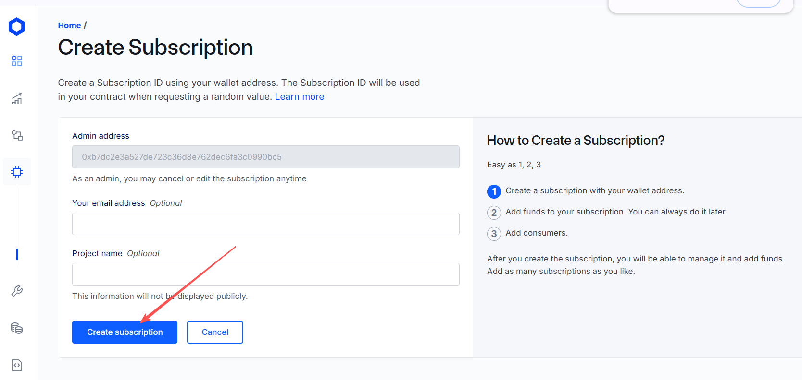
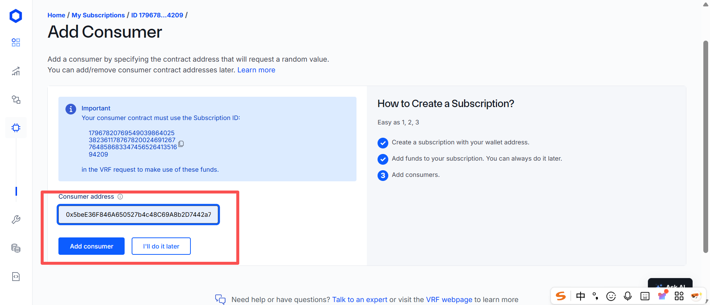
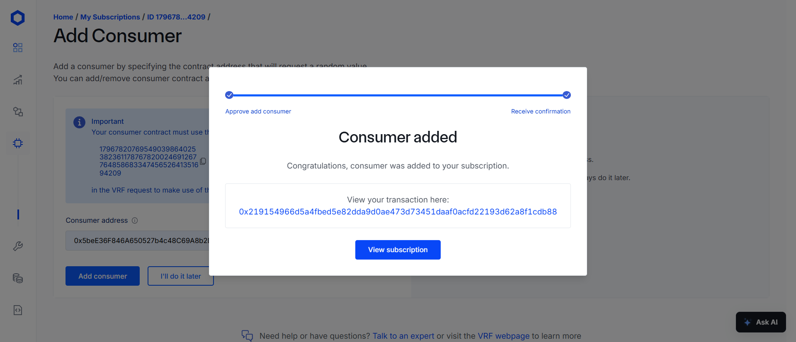

# vrf的使用
[官方文档](https://docs.chain.link/vrf/v2-5/getting-started)
使用教程在Getting Started里
查询各个网络的参数在Supported Networks里

### 案例代码
[remix 案例代码](https://remix.ethereum.org/#url=https://docs.chain.link/samples/VRF/v2-5/VRFD20.sol&autoCompile=true&lang=en&optimize&runs=200&evmVersion&version=soljson-v0.8.31+commit.fd3a2265.js)

### 触发请求，生成requestId
```solidity
uint256 requestId = s_vrfCoordinator.requestRandomWords(
    VRFV2PlusClient.RandomWordsRequest({
        keyHash: i_gasLane, // 最大的gas价格级别
        subId: i_subscriptionId, // 订阅id
        requestConfirmations: REQUEST_CONFIRMATIONS, // 需要被多少个chainLink节点验证
        callbackGasLimit: i_callbackGasLimit,  // 调用回填方法所消耗的最大的gas数量
        numWords: NUM_WORDS,               // 请求回来的随机数个数
        extraArgs: VRFV2PlusClient._argsToBytes(
            VRFV2PlusClient.ExtraArgsV1({nativePayment: false})  // 是用LINK支付还是eth支付
        )
    })
);
```
详细参数解释：https://docs.chain.link/vrf/v2-5/getting-started#contract-variables
另外不同的网络对某些参数的最大值有限制


### 回填随机数
```solidity
function fulfillRandomWords(
    uint256,
    uint256[] calldata randomWords
) internal override {
    uint256 indexOfWinner = (randomWords[0] % s_players.length);
    address payable winner = s_players[indexOfWinner];
    s_recentWinner = winner;
}
```

### 操作说明
#### 创建订阅
控制面板：https://vrf.chain.link/
点击Create Subscription

邮箱，程序名称填写对应的信息，然后点击Create

钱包弹窗签名，然后等待确认


#### 添加资金
往订阅号里，添加LINK


#### 添加消费者
将我们的合约地址填入订阅，作为消费者




### 领水地址
https://faucets.chain.link/sepolia


### 安装依赖
chainlink的vrf2.5项目地址：https://github.com/smartcontractkit/chainlink-brownie-contracts

```shell
forge install /smartcontractkit/chainlink-brownie-contracts
```

我自己Fork的项目地址：https://github.com/minner-fun/chainlink-brownie-contracts/tree/fix/vrfV2_5Mock
由于官方给的V2_5Mock文件会报构造函数参数的错误，所以我进行了一点修改，给构造函数添加了一个用不到的参数
```solidity
// lib\chainlink-brownie-contracts\contracts\src\v0.8\vrf\mocks\VRFCoordinatorV2_5Mock.sol
constructor(uint96 _baseFee, uint96 _gasPrice, int256 _weiPerUnitLink) SubscriptionAPI(msg.sender) {
i_base_fee = _baseFee;
i_gas_price = _gasPrice;
i_wei_per_unit_link = _weiPerUnitLink;
setConfig();
}

//lib\chainlink-brownie-contracts\contracts\src\v0.8\vrf\dev\SubscriptionAPI.sol
constructor(address _sender) ConfirmedOwner(msg.sender) {
address sender = _sender;
}
```

### Mock
需要部署VRFCoordinatorV2_5Mock， LinkToken，[实际案例](https://github.com/minner-fun/foundry-raffle/blob/main/script/HelperConfig.s.sol)

### 创建订阅，充值，添加消费者
在本地链调试的时候需要全套的vrf功能。[实际案例](https://github.com/minner-fun/foundry-raffle/blob/main/script/Interactions.sol)