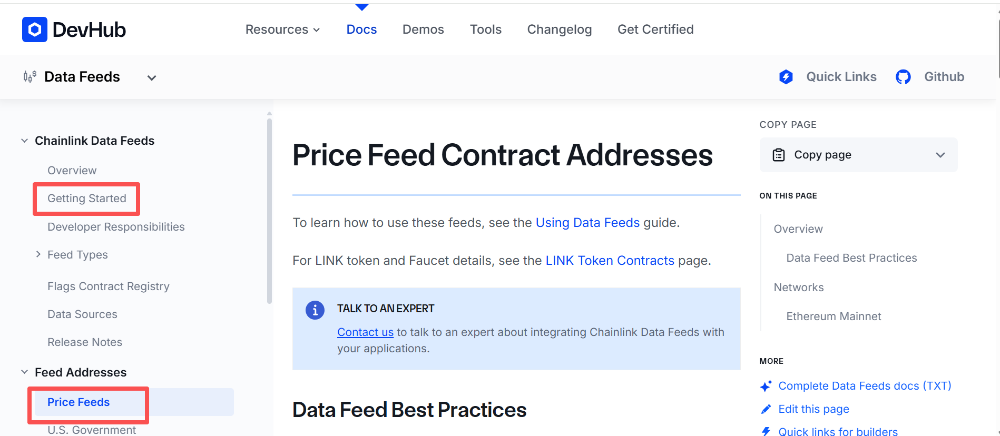

## 基本信息
官方文档：[https://docs.chain.link/data-feeds/getting-started](https://docs.chain.link/data-feeds/getting-started)
教程在Getting started里
各个链的Aggregator地址在Feed Address里


## 使用方法
根据Aggregator地址实例化Aggregator合约，然后直接调用方法，即可拿到价格

```solidity
function getChainlinkDataFeedLatestAnswer(AggregatorV3Interface dataFeed) internal view returns (uint256) {
    (
        /* uint80 roundId */
        ,
        int256 answer,
        /*uint256 startedAt*/
        ,
        /*uint256 updatedAt*/
        ,
        /*uint80 answeredInRound*/
    ) = dataFeed.latestRoundData();
    return uint256(answer) * 1e10;
}
```

## Mock
官方的mock文件：lib\chainlink-brownie-contracts\contracts\src\v0.8\mocks\MockAggregator.sol
mock文件：https://github.com/minner-fun/foundry-fund-me/blob/main/test/mocks/MockV3Aggregator.sol