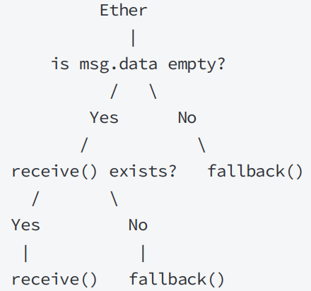
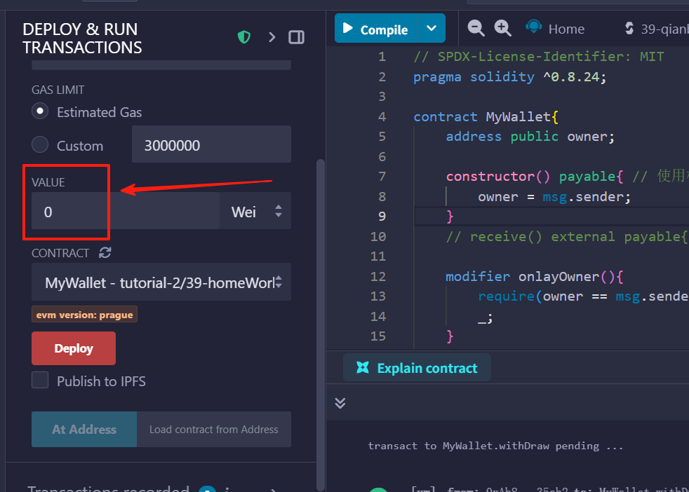

# 0、msg的成员属性 与 address的成员方法
### msg成员
```solidity
msg.data (bytes)： 完整的调用数据
msg.sender (address)： 消息发送方（当前调用）
msg.sig (bytes4)： 调用数据的前四个字节（即函数标识符）。
msg.value (uint)： 随消息发送的 wei 的数量
```

### address相关
速查：https://docs.soliditylang.org/zh-cn/v0.8.24/units-and-global-variables.html#address-related
详细：https://docs.soliditylang.org/zh-cn/v0.8.24/types.html#members-of-addresses
```solidity
<address>.balance （ uint256 ）
以 Wei 为单位的 地址类型 的余额。

<address>.code （ bytes memory ）
在 地址类型 的代码（可以是空的）。

<address>.codehash （ bytes32 ）
地址类型 的代码哈希值

<address payable>.transfer(uint256 amount)
向 地址类型 发送数量为 amount 的 Wei，失败时抛出异常，发送2300燃料的矿工费，不可调节。

<address payable>.send(uint256 amount) returns (bool)
向 地址类型 发送数量为 amount 的 Wei，失败时返回 false 2300燃料的矿工费用，不可调节。

<address>.call(bytes memory) returns (bool, bytes memory)
用给定的数据发出低级别的 CALL，返回是否成功的结果和数据，发送所有可用燃料，可调节。

<address>.delegatecall(bytes memory) returns (bool, bytes memory)
用给定的数据发出低级别的 DELEGATECALL，返回是否成功的结果和数据，发送所有可用燃料，可调节。

<address>.staticcall(bytes memory) returns (bool, bytes memory)
用给定的数据发出低级别的 STATICCALL，返回是否成功的结果和数据，发送所有可用燃料，可调节。
```

### tx.origin
https://docs.soliditylang.org/zh-cn/v0.8.24/units-and-global-variables.html#index-3
是一个全局变量，类似与msg.sender，msg....等等一系列的全局变量  
```solidity
msg.sender  上一层的调用者，可能是合约，也可能是一个外部账户
tx.origin  是最初的那个外部用户
```

#### ⚠️ 安全提醒
https://chatgpt.com/s/t_68dcb1734f7c819196f1e07050850866
在安全实践里，一般不推荐依赖 tx.origin 来做权限控制，因为：
tx.origin 会让合约更容易受到 钓鱼攻击 (phishing attack)。
比如攻击者合约诱导你调用它，然后在内部再调用目标合约，此时 tx.origin 仍然是你，但 msg.sender 已经是攻击者合约。

所以现在主流建议是：

使用 msg.sender 做权限校验。避免依赖 tx.origin。


# 合约转账

要使一个合约能接受eth
> 1、定义一个payable的普通方法\
> 2、要有receive方法，或者是payable的fallback方法\
> 3、构造函数加上payable。
## payable
*一句话：你想让那个方法在调用时可以接受eth，就给那个函数加payable修饰符*

构造函数写成 constructor() payable { ... } 才是正确的。  
你是否需要构造函数 payable，取决于要不要在部署时就存钱进去。 如果要让合约在运行中收钱，记得给收款函数加 payable 或写 receive()。

payable是类似于external，view之类的修饰，所以要写在函数()之后。另外给构造函数constructor()添加payable，只能使函数在部署时，可以接受eth。并不是任何时候都可以接受了。因为只有部署时，构造函数才被调用。让合约可以在运行中收钱，就是设置通用的receive(),callback()方法。或者指定某个函数是payable

```solidity
// SPDX-License-Identifier: MIT
pragma solidity ^0.8.24;

contract SimplePay{

    // address payable owner;
    address owner;

    constructor(){
        owner = msg.sender;
        // owner = payable(msg.sender);
    }
    // 合约接受eth
    // 只要方法中有payable就可以收到eth，
    // 和构造函数中的owner是不是payable没有关系， 
    // 如果是某个地址要接受发送，那就需要payable(地址)
    function receiveEther() external payable{}
    // function receiveEther() external {}

    function queryBalance() external view returns(uint){
        return address(this).balance;
    }
}
```

## fallback receive
只有部署完成后的异常调用才会触发此函数。\
receive: 被设计出来，就是用来专门接受eth的，所以，reverse的定义必须有payable修饰符  \
fallback: 主要职责是处理 不匹配任何函数签名的调用。所以如果不加payable，就处理不了转账的异常嗲用。如果加上，就能处理

### 调用顺序总结（EVM 判断流程）

调用指定函数 → 存在 → 正常执行  \
调用指定函数 → 不存在\
有 data → 触发 fallback()\
没有 data →\
如果定义了 receive() → 触发 receive()\
否则 → 触发 fallback() 

之所以fallback,reveive被调用是因为，异常情况，被调用函数找不到的情况。正常情况，所有逻辑方法还是要正常写的



```solidity
// SPDX-License-Identifier: MIT
pragma solidity ^0.8.24;

contract MyToken {
    event Log(string funName, address sender, uint amount, bytes message);

    uint public a;
    function set(uint _a) public{
        a = _a;
    }
    receive() external payable{
        emit Log("receive", msg.sender, msg.value, "");
    }
    fallback() external payable{
        emit Log("fallback", msg.sender, msg.value, msg.data);
    }
}
```
### receive可以承接部署时冲入的ETH呢？

部署时执行的是构造代码（constructor），而不是运行时代码。receive() / fallback() 只在合约已经部署完成后、收到外部调用时才会触发。\
如果没有写构造函数，编译器会生成一个默认的 non-payable 构造器；\
部署交易若带 value，编译器插入的检查会让交易直接回退。 \
因为在“创建阶段”合约还没有 runtime code，receive()/fallback() 根本不存在，当然不会被调用。

#### 正确写法: 必须显式写出payable的 contstructor构造函数

```solidity
// SPDX-License-Identifier: MIT
pragma solidity ^0.8.24;

contract MyToken {
    // 允许在部署交易里附带 ETH
    constructor() payable {}

    receive() external payable {}
    function sendViaCall(address payable _to, uint amount) external {
        (bool ok, ) = _to.call{value: amount}("");
        require(ok, "call failed");
    }
}

```


## 发送eth
https://docs.soliditylang.org/zh-cn/v0.8.24/units-and-global-variables.html#address-related
官方文档
```solidity
<address payable>.transfer(uint256 amount)
向 地址类型 发送数量为 amount 的 Wei，失败时抛出异常，发送2300燃料的矿工费，不可调节。

<address payable>.send(uint256 amount) returns (bool)
向 地址类型 发送数量为 amount 的 Wei，失败时返回 false 2300燃料的矿工费用，不可调节。

<address>.call(bytes memory) returns (bool, bytes memory)
用给定的数据发出低级别的 CALL，返回是否成功的结果和数据，发送所有可用燃料，可调节。

// transfer send的返回值不一样，transfer没有返回
payable(msg.sender).transfer(amount); // the current contract sends the Ether amount to the msg.sender

bool success = payable(msg.sender).send(address(this).balance);
require(success, "Send failed");

(bool success, ) = payable(msg.sender).call{value: address(this).balance}("");
require(success, "Call failed");

```

transfer/send 与 call背后的逻辑,相当于把gas参数写死为2300后再调用call。\
所以由于transfer/send对gas的限制，就存在gas不够时的诸多隐患。
```solidity
// transfer
(bool ok, ) = _to.call{value: amount, gas: 2300}("");

// send
(bool ok, ) = _to.call{value: amount, gas: 2300}("");

// call
(bool ok, ) = _to.call{value: amount, gas: 无限制}("");
(bool ok, ) = _to.call{value: amount}(""); // 更常用，不指定gas
```
如果调用transfer/send方法的是EOA一个普通的外部账户，那么没什么问题。但是如果调用transfer/send的是 \
一个合约地址，并且如果有人在receive，或者fallback写入过于消耗gas的逻辑，那么整个调用就会因为gas耗尽而失败 \
我们知道，当调用一个合约的方法，但是没有指名函数选择器，也就是data数据为空时，\ 
EVM会自动判断选择执行receive，或者fallback。而receive，或者fallback就是这种调用方式

```solidity
// SPDX-License-Identifier: MIT
pragma solidity ^0.8.24;
contract MyToken{

    receive() external payable{}
    function sendViaTransfer(address payable _to, uint amount) external {
        _to.transfer(amount);  // 这里是eth从合约中转给_to地址。
    }
    function sendViaSend(address payable _to, uint amount) external{
        bool sended = _to.send(amount);  // 返回一个布尔类型
        require(sended, "Failed to send Ether");
    }
    function sendViaCall(address payable _to, uint amount) external{
        (bool success, ) = _to.call{value: amount}("");  // {}大括号里是传入的金额值
        require(success, "Failed to send Ether");
    }
}
```

## eth钱包案例

```solidity
// SPDX-License-Identifier: MIT
pragma solidity ^0.8.24;

contract MyWallet{
    address public owner;

    constructor() payable{ // 使用构造函数payable，在合约部署的时候可以转入eth
        owner = msg.sender;
    }
    // receive() external payable{}  

    modifier onlayOwner(){
        require(owner == msg.sender, "musu owner can do this");
        _;
    }

    function withDraw(address payable _to, uint amount) external onlayOwner{
        (bool sended,) = _to.call{value: amount}("");
        require(sended, "send failue");
    }

    function getBalance() public view returns(uint){
        return address(this).balance;
    }
}
```

## 界面操作
用于传入msg.data的数据，主要是receive和fallback函数会用到这里

### 设置传入合约的金额



# 2、调用其他合约
## 基本方法
需要被调用合约的源码，把被调用合约看成一个合约数据类型，在其他合约中创建该合约类型的实例，在调用的时，传入被调用合约地址，实例化合约，然后调用其中方法。
### 写法一 传入合约地址，在参数类型位置指定合约类型
### 写法二 参数传入地址，参数类型为address，在调用的时候再实例化
```solidity
// SPDX-License-Identifier: MIT
pragma solidity ^0.8.24;

contract MyTarget{

    uint public x;
    function setX(uint _x) public{
        x = _x;
    }
    function getX() public view returns(uint){
        return x;
    }
    function setXandE(uint _x) public payable{
        x = _x;
    }
    function getXandV() public view returns(uint, uint){
        uint val = address(this).balance;
        return (x, val);
    }
}


contract MyCaller{
    function cllTargetX(MyTarget target, uint _x) external{ // 写法一 在参数的时候指定合约类型
        target.setX(_x);
    }
    function callTargetGet(address target) external view returns(uint){
        return MyTarget(target).getX();  // 写法二 参数传入地址，在调用的时候实例化
    }
    function callTargetSetXandE(address target, uint _x) external payable{
        MyTarget(target).setXandE{value: msg.value}(_x);  // 给msg传值的写法，写到大括号里
    }
    function callTargetXandV(address adr) external view returns(uint, uint){
        (uint x, uint v) = MyTarget(adr).getXandV();
        return (x,v);
    }
}
```


## interface
提供A合约地址，在interface中定义A合约所包含函数的声明（肯定不用给出具体逻辑）。就可以在另外一个函数中实现对A合约的方法的调用
其实就是借助interface结构，提供了合约中函数信息。
和上面基本方法中第二种写法类似，只是把原本的合约类型换成了interface
```solidity
// SPDX-License-Identifier: MIT
pragma solidity ^0.8.24;

interface IConter{
    function get() external view returns(uint256);
    function add() external;
}

contract Call{
    function callGet(address conter) public view returns(uint256){
        return IConter(conter).get();
    }
    function callSet(address conter) public{
        IConter(conter).add();
    } 
}

// SPDX-License-Identifier: MIT
pragma solidity ^0.8.24;

contract Conter{
    uint public num;
    function get() external view returns(uint){
        return num;
    }
    function add() external {
        num += 1;
    }
}
```

## call方法调用其他合约
更通用，的基准调用方法。通过calldata来调用，返回调用成功与否的结果，函数返回值的bytes类型
注意写法：
```solidity
(bool success, bytes memory _data) = target.call(abi.encodeWithSignature(signature, _fooNum, _fooMessage));
(bool success, bytes memory _data) = target.call(abi.encodeWithSelect(function select, _fooNum, _fooMessage));
(bool success, bytes memory _data) = target.call(abi.encodeCall(function point, (_fooNum, _fooMessage)));
(bool success, bytes memory _data) = target.call(abi.encodeCall{value:xxx, gas: 1000000}("")); // value,gas顺序不重要
(bool success, bytes memory _data) = target.call(abi.encodeCall(""));
```

完整示例
```solidity
// SPDX-License-Identifier: MIT
pragma solidity ^0.8.24;
contract MyToken {
    uint public num;
    string public message;
    event Log(string message);

    function foo(uint _num, string memory _message) external payable {
        num = _num;
        message = _message;
    }

    receive() external payable { 
        emit Log("receive was called");
    }

    fallback() external payable { 
        emit Log("fallback wass called");
    }

}

interface IMyToken {
    function foo(uint _num, string memory _message) external payable;
}

contract Call{

    constructor() payable{}

    bytes public data;

    function callWithContract(address payable target, uint _fooNum, string memory _fooMessage) public {
        MyToken(target).foo{value:100}(_fooNum, _fooMessage);
    }

    function callWithParam(MyToken target, uint _fooNum, string memory _fooMessage) public {
        target.foo{value:100}(_fooNum, _fooMessage);
    }

    function callWithInterface(address payable target, uint _fooNum, string memory _fooMessage) public {
        IMyToken(target).foo{value:100}(_fooNum, _fooMessage);
    }
    function callWithSignature(address target, uint _fooNum, string memory _fooMessage) public {
        (bool success, bytes memory _data) = target.call{value:100}(abi.encodeWithSignature("foo(uint256,string)", _fooNum, _fooMessage));
        require(success, "call failed");
        data = _data;
    }
    function callWithSelect(address target, uint _fooNum, string memory _fooMessage) public{
        (bool success, bytes memory _data) = target.call{value:100}(abi.encodeWithSelector(bytes4(keccak256(bytes("foo(uint256,string)"))), _fooNum, _fooMessage));
        require(success, "call failed");
        data = _data;
    }
    function callWithCall(address target, uint _fooNum, string memory _fooMessage) public {
        (bool success, bytes memory _data) = target.call{value:100}(abi.encodeCall(IMyToken(target).foo, (_fooNum, _fooMessage)));
        require(success, "call failed");
        data = _data;
    }
    function noneCallWithData(address target, uint _none) public {
        (bool success, bytes memory _data) = target.call{value:100}(abi.encodeWithSignature("none(uint256)", _none));
        require(success, "none call failed");
        data = _data;
    }
    function noneCallWithNone(address target) public {
        (bool success, bytes memory _data) = target.call{value:100}("");
        require(success, "none call failed");
        data = _data;
    }
}
```


## delegatecall
与call不同的是，它只使用给定地址的代码， 所有其他方面（存储，余额，…）都取自当前的合约。（所以delegatecall不需要转移以太币） \
delegatecall 的目的是为了使用存储在另一个合约中的库代码。 用户必须确保两个合约中的存储结构都适合使用delegatecall。
delegatecall 使变量是存储到自身合约中的。调用合约与被调用合约的状态变量顺序要对应。
https://docs.soliditylang.org/zh-cn/v0.8.24/introduction-to-smart-contracts.html#index-13

#### 特别注意：delegatecall不能传{value:xxx,gas:xxx}
```solidity
// 传参方法与call完全一致
(bool success, bytes memory _data) = target.delegatecall(abi.encodeWithSelector(Callee.set.selector, _num));
```


## staticcall
从 byzantium 开始，也可以使用 staticcall。这基本上与 call 相同， 但如果被调用的函数以任何方式修改了状态，则会恢复。
也就是说staticcall只能查询第三合约的数据，主要是查询，没有权限修改
https://chatgpt.com/s/t_68a04cc99eac8191ade24b3175a639de

#### 特别注意：staticcall也不能传{value:xxx,gas:xxx}


## delegatecall 与 staticcall案例
```solidity
// SPDX-License-Identifier: MIT
pragma solidity ^0.8.24;

contract Callee {
    uint256 public num;
    function set(uint256 _num) public payable returns(uint){
        num = 3 * _num;
        return num;
    }
    function get() public view returns(uint){
        return num;
    }
}

contract Caller {
    uint public num;    // 这里要与被调用的合约的状态变量定义顺序对应上
    bytes public data;  // 多出来的变量写下面

    function setNum(address target, uint256 _num) public{
        (bool success, bytes memory _data) = target.delegatecall(abi.encodeWithSelector(Callee.set.selector, _num));
        require(success, "call failed");
        data = _data;
    }
    function setNumWithSignature(address target, uint256 _num) public{
        (bool success, bytes memory _data) = target.delegatecall(abi.encodeWithSignature("set(uint256)", _num));
        require(success, "call failed");
        data = _data;
    }
    function staticcallWithNone(address target) public {
        (bool success, bytes memory _data) = target.staticcall(abi.encodeWithSignature("get()"));
        require(success, "call failed");
        data = _data;
    }
    // 报错，staticcall是不能修改内容的
    function staticcallWithNum(address target, uint256 _num) public{
        (bool success, bytes memory _data) = target.staticcall(abi.encodeWithSignature("set(uint256)", _num));
        require(success, "call failed");
        data = _data;
    }
}
```


# 编码与解码

### Keccak256 Hash Function
Keccak256需要字节类型的输⼊，因此需要将参数编码为字节
使⽤ abi.encode 和 abi.encodePacked 进⾏编码
区别： abi.encode 保留更多信息，会填充0
       abi.encodePacked 压缩数据 只保留了非零的数据

Keccak256哈希冲突
因为encodePacked在编码('aaa','bbb') 与('aa', 'abbb')时，由于压缩，返回的结果一样，所以被keccak256哈希后，结果是一样的。就有了哈希冲突。
当然encode编码不存在这个问题，它自身就会填充很多0，不同输入是不同的。
解决办法：就是在encodePacked的参数中多加一个其他的参数('aaa','bbb') => ('aa', 2, 'abbb')这肯定就不一样了

```solidity
// SPDX-License-Identifier: MIT
pragma solidity ^0.8.3;


 // 总结，为了对应哈希碰撞，如果用encodePacked方法的话，就需要在两个参数直接加如一个另外一个参数。
 // 如果是encode的话就不需要

contract HashFunc {
    function hash(
        string memory text,
        uint256 num,
        address addr
    ) external pure returns (bytes32) {
        // keccak256接收bytes类型，需要用encode或者encodePacked一下
        return keccak256(abi.encodePacked(text, num, addr));
        // abi.encode
    }

    function collision(string memory text0, string memory text1)
        external
        pure
        returns (bytes32)
    {
        return keccak256(abi.encode(text0, text1));
    }

    function collision_2(string memory text0, string memory text1)
        external
        pure
        returns (bytes32)
    {
        return keccak256(abi.encodePacked(text0, text1));
    }

    function encode(string memory text0, string memory text1)
        external
        pure
        returns (bytes memory)
    {
        return abi.encode(text0, text1); // 生成的值会被填充零
    }

    function encodePacked(string memory text0, string memory text1)
        external
        pure
        returns (bytes memory)
    {
        return abi.encodePacked(text0, text1); // 被压缩后的结果，有个问题，如果输入两个参数'aaa' 'bbb'与输入'aa' 'abbb'结果一样，这就有问题，所以需要价格中间的参数
    }
}

```


### Function Select 与 signature 与 函数指针
https://chatgpt.com/s/t_689bf423aba88191aa996d9944bc3926  
#### signature 
函数签名,是 "函数名(参数类型列表)"
```
"transfer(address,uint256)"
```

#### function select: 
取函数签名（函数名(参数类型列表)，不带空格）做 keccak256 哈希，再取前 4 个字节。或者 更具函数指针.select
```solidity
bytes4(keccak256(bytes(signature))
IOverload.foo.select
```
#### 函数指针
在 Solidity 中，函数本身也是一种对象，可以通过 *合约名.函数名* 这种形式引用。
这种引用就叫做 函数指针。函数指针就是函数本身，还没有执行的函数的定义。

```solidity
interface IOverload {
    function foo(uint256) external returns (uint256);
    function foo(string calldata) external returns (bytes32);
}

abi.encodeCall(IOverload.foo(string), ("hi"));      // ✅

// 方式2：先声明函数指针变量再传
function(uint256) external returns (uint256) fp = IOverload.foo;
abi.encodeCall(fp, (123));
```

### msg.data 与 calldata
在 Solidity 里，msg.data 代表的是本次外部调用的完整 calldata，也就是调用者（EOA 或合约）发给当前合约的原始字节数据。
> “EVM 调用我这个函数时，传过来的所有原始参数数据（包含函数选择器 + 编码后的参数）”。

当你用 ABI 编码规则调用一个合约函数时，msg.data 的结构通常是：
```
[ 4 字节 函数选择器 ][ 编码后的参数1 ][ 编码后的参数2 ] ...
```


完整示例
```solidity
// SPDX-License-Identifier: MIT
pragma solidity ^0.8.23;

contract FunctionSelector {
    function getSelector(string calldata _func) external pure returns (bytes4) {
        return bytes4(keccak256(bytes(_func)));  // bytes4 会截取前8个字符  对"transfer(address,uint256)"进行处理后，就得到了0xa9059cbb
    }                                                 //  注意这里""也是要一并输入的,并且uint256一点不能简写成uint，这是关于字符的加密，所以简写就相当于字符不一样了
    function getSelector2(string calldata _func) external pure returns (bytes4) {
        return bytes4(keccak256(abi.encode(_func)));
    }
    function getTest(string calldata _func) external pure returns(bytes memory, bytes memory){
        return (bytes(_func),abi.encodePacked(_func));
        // 但是encodePacked得结果可能和bytes之后的结果相同，这里先不做深入研究了
    }
}


// 证明msg.data的结构
//0xa9059cbb 0000000000000000000000005b38da6a701c568545dcfcb03fcb875f56beddc4 000000000000000000000000000000000000000000000000000000000000007b
contract Receiver {
    event Log(bytes data);
    event TLog(bytes indexed data, address indexed addr, uint indexed num);

    function transfer(address _to, uint256 _amount) external {
        emit Log(msg.data);
        emit TLog(msg.data, _to, _amount);
    }
}

```

### abi.encode 与 abi.decode
就是一个编码，一个解码
abi.encode(...) 生成的是完整的 ABI 标准编码。
abi.decode(...) 正因为abi.encode包含了长度信息、偏移信息、padding。所以decode能够正确解析
而abi.encodePacked仅仅是各个参数的bytes转码拼接而已，所以不能被decode解码。是不可逆，不可还原的数据

结构体传入的时候还是用[]方括号
`abi.encode(x, addr, arr, myStruct); // 直接把各种变量放进去`

`(x, addr, arr, myStruct) = abi.decode(data,(uint256, address, uint256[], MyStruct)); // 注意解码方法有两个参数，第二个用来指定数据类型，用小括号括起来`

#### 完整案例
```solidity
// SPDX-License-Identifier: MIT
pragma solidity ^0.8.23;

contract AbiDecode {
    struct MyStruct {
        string name;
        uint256[2] nums;
    }

    function encode(
        uint256 x,
        address addr,
        uint256[] calldata arr,
        MyStruct calldata myStruct
    ) external pure returns (bytes memory) {
        return abi.encode(x, addr, arr, myStruct); // 直接把各种变量放进去
    }

    function decode(bytes calldata data)
        external
        pure
        returns (
            uint256 x,
            address addr,
            uint256[] memory arr,
            MyStruct memory myStruct
        )
    {
        (x, addr, arr, myStruct) = abi.decode(data,(uint256, address, uint256[], MyStruct)); // 注意解码方法有两个参数，第二个用来指定数据类型，用小括号括起来
    }
}

```


### abi.encode 与 abi.encodePacked 与 bytes 与 bytes.concat

abi.encode 包含了长度信息、偏移信息、padding, 为标准的ABI编码，对参数进行编码生成calldat用于合约间传递信息
abi.encodePacked 数据被压缩，可以理解成分别将各个参数bytes后拼接而成
```solidity
// abi.encode后的结果
0x
0000000000000000000000000000000000000000000000000000000000000020  // 偏移量
0000000000000000000000000000000000000000000000000000000000000022  // 长度 0x22 = 34
7472616e7366657228616464726573732c75696e7432353629                 // 原始字符串
00000000000000000000000000000000000000000000000000000000           // padding

// encodePacked的结果
0x7472616e7366657228616464726573732c75696e7432353629  // 类似与encode后的原始字符串的部分
```


abi.encodePacked("aaa", "bbb", "ccc") 的结果就是把 "aaa"、"bbb"、"ccc" 各自转成 UTF-8 原始字节，然后直接拼接在一起,容易哈希碰撞  
而bytes.concat()就是专门把多个bytes拼接在一起的
```solidity

bytes("aaa") = 0x616161
bytes("bbb") = 0x626262
bytes("ccc") = 0x636363

function encodePacked_and_bytes() public pure returns(bytes memory, bytes memory){
    bytes memory a;
    bytes memory b;
    a = abi.encodePacked("aaa", "bbb", "ccc");
    b = bytes.concat(bytes("aaa"), bytes("bbb"), bytes("ccc"));
    return (a, b);
}

a = b = 0x616161626262636363 // 就是直接拼接起来的
```

### Keccak256
称为 哈希函数
输入为bytes memory  输出为bytes32

#### 隐式转换-字符串字面量
```solidity
// 是因为字符串字面量（比如直接写的 "..."）在 Solidity 里有个特殊待遇：它可以隐式转换成 bytes memory
full2 = keccak256("transfer(address,uint256)");

// 等价于
full2 = keccak256(bytes("transfer(address,uint256)"));
// 也等价于：
full2 = keccak256(abi.encodePacked("transfer(address,uint256)"));

```
“隐式转换”只对字面量生效。对于变量是不行的
```solidity
string memory sig = "transfer(address,uint256)";
// ❌ 不行：string 变量不会自动变成 bytes
full2 = keccak256(sig);
```
#### 常用场景
```solidity
bytes4(keccak256(bytes(_func))); //函数选择器的生成方式
```

##### bytes
_func 是 string 类型，Solidity 中的 string 实际上是一个 UTF-8 编码的动态字节数组。
bytes(_func) 会把这个 string 转成一个 纯字节序列（bytes 类型），不带长度信息，就是字符串的原始字节。
keccak256(bytes(_func)) 计算的哈希，正好是按照 ABI 函数选择器规范 所需要的 “函数签名的 UTF-8 字节” 进行计算。
##### abi.encode
abi.encode(...) 是 ABI 编码，它会把 _func 当作一个参数进行完整的 ABI 序列化，这会多出额外的元信息（长度 + padding），不再是原始字符串字节。

##### 使用abi.encodePacked和bytes的输出是等价的。可以替代。
https://chatgpt.com/s/t_689bf5a081408191a8b6a15dee3370d6
https://chatgpt.com/s/t_68be4da094108191888072582f33704e


### encodeWithSignature 与 abi.encodeWithSelector 与 abi.encodeCall
>想要“标准 ABI 编码 + 编译期类型校验 + 不写字符串”，用 abi.encodeCall;  
>想手写 selector 就用 abi.encodeWithSelector；  
>非要字符串才用 abi.encodeWithSignature。

abi.encodeWithSignature: 直接用 "transfer(address,uint256)" 这种函数名字符串来输入，进行编码，这种函数名称为函数signature
abi.encodeWithSelector： 将函数选择器输入，进行编码
abi.encodeCall: 形参：functionPointer 必须是一个 external 函数指针（通常来自接口或合约的函数引用），第二个参数是把所有实参放进 一个 tuple 里（要写成 (arg1, arg2, ...) 的样子）。
```solidity
abi.encodeWithSignature(string memory signature, ...) returns (bytes memory)
```
等价于
```solidity
abi.encodeWithSelector(bytes4(keccak256(bytes(signature))), ...)
```
等价于
```solidity
abi.encodeCall(function functionPointer, (...)) returns (bytes memory)
```

上面代码中的signature就为："transfer(address,uint256)"
所以，函数选择器为
```solidity
bytes4(keccak256(bytes(signature))
```
function functionPointer 为函数指针，重载情况跟具参数来区分

#### 对于encodeCall的重载函数，需要手动写明参数类型来区分
```solidity
interface IOverload {
    function foo(uint256) external returns (uint256);
    function foo(string calldata) external returns (bytes32);
}

// 方式1：在类型上标注签名
abi.encodeCall(IOverload.foo, (123));               // ❌ ambiguous
abi.encodeCall(IOverload.foo(uint256), (123));      // ✅

abi.encodeCall(IOverload.foo(string), ("hi"));      // ✅

// 方式2：先声明函数指针变量再传
function(uint256) external returns (uint256) fp = IOverload.foo;
abi.encodeCall(fp, (123));                          // ✅

```


#### 实际案例
gpt说推荐用encodeCall说是省gas，并且有校验，但是我发现这种却是最贵的。

```solidity
// SPDX-License-Identifier: MIT
pragma solidity ^0.8.24;

interface IERC20{
    function transfer(address _to, uint amount) external;
}

contract DataEncode{
    // 1459
    function encodeWithsign(address _to, uint amount) external pure returns(bytes memory){
        return abi.encodeWithSignature("transfer(address,uint256)", _to, amount);  // 直接传入字符串就行了
    }
    // 1493
    function encodeWithselect(address _to, uint amount) external pure returns(bytes memory){
        return abi.encodeWithSelector(IERC20.transfer.selector, _to, amount);    // 需要源码，获取selector
    }
    // 1506
    function encodeCall(address _to, uint amount) external pure returns(bytes memory){
        return abi.encodeCall(IERC20.transfer, (_to, amount));    // 这里参数是放到了一个参数位置里，也需要获取selector
    }
}
```

### 三种编码方式与abi.encode、abi.encodePacked

三种方法生成calldata，这个colldata就是被调用合约的msg.data。
calldata的数据结构也是：函数选择器+参数ABI编码
```solidity
// 做直观理解，内部实现肯定不是这样。
bytes.concat(sel, abi.encode(a, b, c)) == aib.encodePacked(sel, abi.encode(a, b, c)) // 这里encodePacked也是仅仅起到了拼接作用 
abi.encodeWithSelector(sel, a, b, c) == bytes.concat(sel, abi.encode(a, b, c)); // 拼接了函数选择器的bytes与参数的bytes

abi.encodeWithSignature("f(uint256,address)", x, y) == abi.encodeWithSelector(bytes4(keccak256("f(uint256,address)")), x, y);

abi.encodeCall(IFace.f, (x, y)) == abi.encodeWithSelector(IFace.f.selector, x, y);
```

所以，是可在fallback里拦截到，把msg.data的前四个字节抛出后，就可以用abi.decode()解码的
```solidity
fallback() external payable {
    bytes4 sel = msg.sig;                     // 前 4 字节选择器
    // 假设我们知道参数类型：
    (address to, uint256 amt) = abi.decode(msg.data[4:], (address, uint256));
}
```
```solidity
function test(uint256 x, string memory s)
    public
    pure
    returns (
        bytes memory,
        bytes memory,
        bytes memory,
        bytes memory,
        bytes memory,
        bytes memory
    )
{
    bytes4 sel = bytes4(keccak256("foo(uint256,string)"));

    bytes memory a = abi.encodeWithSelector(sel, x, s);
    bytes memory b = bytes.concat(sel, abi.encode(x, s));
    bytes memory c = abi.encodePacked(sel, abi.encode(x, s));
    bytes memory d = abi.encodeWithSignature("foo(uint256,string)", x, s);
    bytes memory e = abi.encodeCall(MyToken.foo, (x, s));
    bytes memory f = abi.encodeCall(IMyToken.foo, (x, s));

    return (a, b, c, d, e, f);
}
```

https://docs.soliditylang.org/zh-cn/v0.8.24/cheatsheet.html#abi
多签钱包还没弄，721要理解一下代码，能更好的理解两个拍卖
