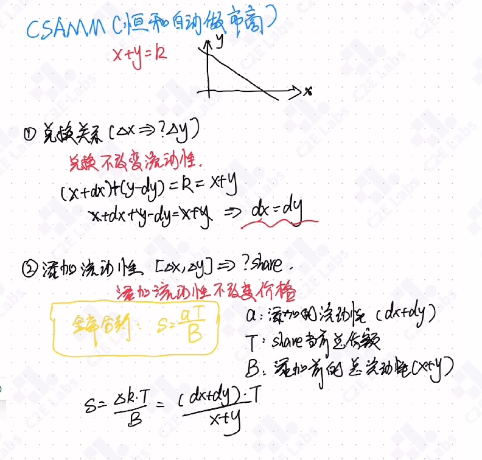
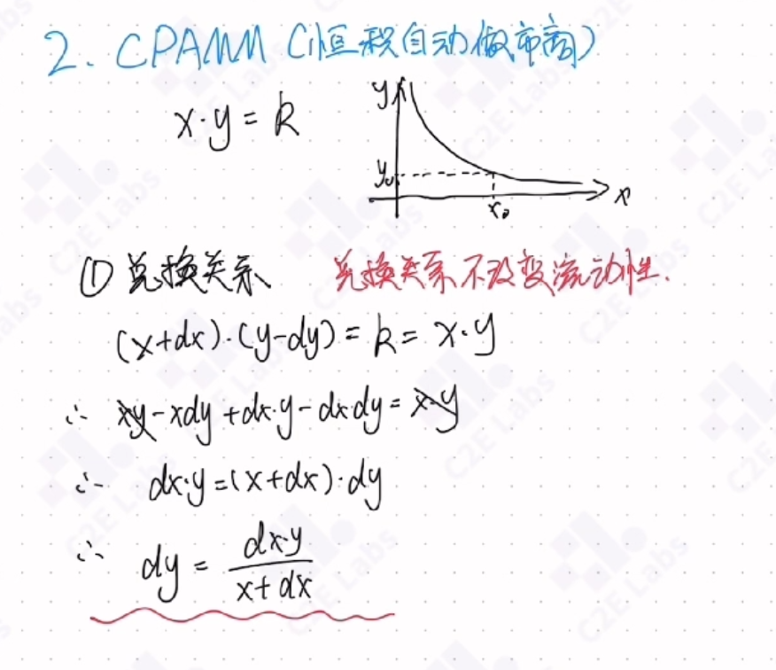

# 其他案例

## 关于call的各种调用
```solidity
// SPDX-License-Identifier: MIT
pragma solidity ^0.8.24;

contract MyToken {
    uint256 public num;
    string public message;
    event Log(string message);

    function foo(uint256 _num, string memory _message) external payable {
        num = _num;
        message = _message;
    }

    receive() external payable {
        emit Log("receive was called");
    }

    fallback() external payable {
        emit Log("fallback wass called");
    }
}

interface IMyToken {
    function foo(uint256 _num, string memory _message) external payable;
}

contract Call {
    constructor() payable {}

    bytes public data;

    function callWithContract(
        address payable target,
        uint256 _fooNum,
        string memory _fooMessage
    ) public {
        MyToken(target).foo{value: 100}(_fooNum, _fooMessage);
    }

    function callWithParam(
        MyToken target,
        uint256 _fooNum,
        string memory _fooMessage
    ) public {
        target.foo{value: 100}(_fooNum, _fooMessage);
    }

    function callWithInterface(
        address payable target,
        uint256 _fooNum,
        string memory _fooMessage
    ) public {
        IMyToken(target).foo{value: 100}(_fooNum, _fooMessage);
    }

    function callWithSignature(
        address target,
        uint256 _fooNum,
        string memory _fooMessage
    ) public {
        (bool success, bytes memory _data) = target.call{value: 100}(
            abi.encodeWithSignature("foo(uint256,string)", _fooNum, _fooMessage)
        );
        require(success, "call failed");
        data = _data;
    }

    function callWithSelect(
        address target,
        uint256 _fooNum,
        string memory _fooMessage
    ) public {
        (bool success, bytes memory _data) = target.call{value: 100}(
            abi.encodeWithSelector(
                bytes4(keccak256(bytes("foo(uint256,string)"))),
                _fooNum,
                _fooMessage
            )
        );
        require(success, "call failed");
        data = _data;
    }

    function callWithCall(
        address target,
        uint256 _fooNum,
        string memory _fooMessage
    ) public {
        (bool success, bytes memory _data) = target.call{value: 100}(
            abi.encodeCall(IMyToken(target).foo, (_fooNum, _fooMessage))
        );
        require(success, "call failed");
        data = _data;
    }

    function noneCallWithData(address target, uint256 _none) public {
        (bool success, bytes memory _data) = target.call{value: 100}(
            abi.encodeWithSignature("none(uint256)", _none)
        );
        require(success, "none call failed");
        data = _data;
    }

    function noneCallWithNone(address target) public {
        (bool success, bytes memory _data) = target.call{value: 100}("");
        require(success, "none call failed");
        data = _data;
    }

    function callWitnSelfHsah(
        address _target,
        uint256 _value,
        uint256 _num,
        string memory _message
    ) public {
        bytes memory data_tmp = abi.encodePacked(
            bytes4(keccak256(bytes("foo(uint256,string)"))),
            abi.encode(_num, _message)
        );
        (bool success, bytes memory _data) = _target.call{value: _value}(
            data_tmp
        );
        require(success, "faile");
        data = _data;
    }
    // 都是相等的
    function test(uint256 x, string memory s)
        public
        pure
        returns (
            bytes memory,
            bytes memory,
            bytes memory,
            bytes memory,
            bytes memory,
            bytes memory
        )
    {
        bytes4 sel = bytes4(keccak256("foo(uint256,string)"));

        bytes memory a = abi.encodeWithSelector(sel, x, s);
        bytes memory b = bytes.concat(sel, abi.encode(x, s));
        bytes memory c = abi.encodePacked(sel, abi.encode(x, s));
        bytes memory d = abi.encodeWithSignature("foo(uint256,string)", x, s);
        bytes memory e = abi.encodeCall(MyToken.foo, (x, s));
        bytes memory f = abi.encodeCall(IMyToken.foo, (x, s));

        return (a, b, c, d, e, f);
    }
}

```


## 金库合约

### 核心原理
增加多少百分比的金额，就增发多少百分比的份额

$$
\begin{aligned}
\frac{a + B}{B} = \frac{s + T}{T}
\end{aligned}
$$

推导过程

$$
\begin{aligned}
\frac{a}{B} = \frac{s}{T} \quad \Leftrightarrow \quad aT = sB
\end{aligned}
$$

添加金额，获取股份

$$
\begin{aligned}
s = \frac{a * T}{B} \quad \Leftrightarrow \quad s = \frac{a}{B} *  T 
\end{aligned}
$$

销毁股份，赎回金额

$$
\begin{aligned}
a = \frac{s * B}{T} \quad \Leftrightarrow \quad a = \frac{s}{T} *  B
\end{aligned}
$$


### inflation Attack
**核心：是solidity的向下取整机制，transfer转账，绕过了share记录**
当计算得到小数时，由于solidity没有浮点数，所以会向下取整，整好把小数部分给省略了。0.xxx直接变为了0
```solidity
function get(uint a, uint b) public pure returns(uint){
    return a/b;
}
```
操作流程：攻击者在先存入小金额，获得一点shure，然后通过transfer的方式给合约转账巨额金额，使合约的B变大，因为上面我们知道s的计算是 aT的积除以B，所以，只要B足够大，就能使新计算的s是个小数，结果solidity向下取整为0，结果新用户就得不到s，而攻击者在取款的时候，a = sB/T,因为其他用户根本就没有获得过s所以，总的股份T=s，所以a = B，所以，金库合约的所以资金都属于攻击者了。

### 防范方法
1.通过独立的变量记录账户的余额  
2.让合约第一个充值   

### 完整代码
```solidity
// SPDX-License-Identifier: MIT

pragma solidity ^0.8.24;

import {IERC20} from "../common/IERC20.sol";

contract Vault {
    IERC20 public immutable TOKEN;
    uint256 public totalSupply;
    mapping(address => uint) public balanceOf;
    constructor(address _token){
        TOKEN = IERC20(_token);
    }

    function _mint(address _to, uint _share) private{
        totalSupply += _share;
        balanceOf[_to] += _share;
    }

    function _burn(address _from, uint _share) private{
        totalSupply -= _share;
        balanceOf[_from] -= _share;
    }

    // s = at/b
    function deposit(uint _amount) external {
        require(_amount > 0, "Amount must be greater than 0");
        uint share;
        if (totalSupply == 0){
            share = _amount;
        }else{
            share = _amount * totalSupply / TOKEN.balanceOf(address(this));
        }
        _mint(msg.sender, share);
        require(TOKEN.transferFrom(msg.sender, address(this), _amount), "tansfer failed");
    }
    // a = sb/t
    function withdraw(uint _share) external {
        require(_share > 0, "Shares must be greater than 0");
        uint amount = _share * TOKEN.balanceOf(address(this)) / totalSupply;
        _burn(msg.sender, _share);
        require(TOKEN.transfer(msg.sender, amount), "transfer failed"); 
    }
}
```

## 恒和自动做市商

### 几个核心原则
> 兑换不改变流动性  
> 添加、移除流动性不改变价格  


流动性：代币对

$$
x + y
$$

添加流动性：添加的是一个代币对，是一对

$$
△x + △y
$$

价格：价格就是保证两个币的兑换比例一样

$$
\begin{aligned}
\frac{x + △x}{y + △y} = \frac{x}{y} \quad \Leftrightarrow \quad \frac{△x}{△y} = \frac{x}{y}
\end{aligned}
$$

### 公式结论
#### 兑换关系
提供多少个x，就能提取多少个y

$$
△x = △y
$$
#### 添加流动性
提供 x,y 获取share

$$
\begin{aligned}
s = \frac{△x + △y}{x + y} * T
\end{aligned}
$$
可以理解为：
$$
\begin{aligned}
s = α * T  \quad 其中α为 \quad α = \frac{△x + △y}{x + y}
\end{aligned}
$$
#### 移除流动性

$$
\begin{aligned}
△x = \frac{s}{T} * x \quad, \quad △y = \frac{s}{T} * y
\end{aligned}
$$
可以理解为：
$$
\begin{aligned}
△x = α * x \quad, \quad △y = α * y \quad, \quad
其中α为 \quad α = \frac{s}{T}
\end{aligned}
$$
### 推导过程

#### 添加流动性公式

#### 移除流动性公式

### 完整代码
```solidity

// SPDX-License-Identifier: MIT


pragma solidity ^0.8.24;
contract CSAMM{
    IERC20 public immutable token0;
    IERC20 public immutable token1;

    uint public reserve0;
    uint public reserve1;

    uint public totalSupply;
    mapping(address => uint) public balanceOf;

    constructor(address _token0, address _token1){
        token0 = IERC20(_token0);
        token1 = IERC20(_token1);
    }

    function _mint(address _to, uint _amount) private {
        balanceOf[_to] += _amount;
        totalSupply += _amount;
    }

    function _burn(address _from, uint _amount) private {
        balanceOf[_from] -= _amount;
        totalSupply -= _amount;
    }

    function _update(uint _res0, uint _res1) private{
        reserve0 = _res0;
        reserve1 = _res1;
    }

    // dx = dy
    function swap(address _tokenIn, uint256 _amountIn) external returns(uint256 amountOut){
        require(_tokenIn == address(token0) || _tokenIn == address(token1), "invalid token");
        require(_amountIn > 0, "amount in = 0");
        bool isToken0 = _tokenIn == address(token0);
        (IERC20 tokenIn, IERC20 tokenOut, uint256 resIn) = isToken0 ? (token0, token1, reserve0) : (token1, token0, reserve1);
        require(tokenIn.transferFrom(msg.sender, address(this), _amountIn), "transfer failed");

        // 不能直接相信_amountIn，有可能用户声称传入了100个，实际到了没有100个，还是用这种实际收到的计算比较靠谱
        uint256 amountIn = tokenIn.balanceOf(address(this)) - resIn;

        amountOut = (amountIn * 997) / 1000;
        require(tokenOut.transfer(msg.sender, amountOut), "transfer failed");

        _update(token0.balanceOf(address(this)), token1.balanceOf(address(this)));
    }

    // 公式里的xy就是reserve了，reserve表示转账之前的，通过balanceOf获得转账之后的
    // shares = (dx + dy)/(x + y) * T
    function addLiquidity(uint _amount0, uint _amount1) external returns(uint256 shares){
        require(token0.transferFrom(msg.sender, address(this), _amount0), "transfer failed");
        require(token1.transferFrom(msg.sender, address(this), _amount1), "transfer failed");

        uint256 bal0 = token0.balanceOf(address(this));
        uint256 bal1 = token1.balanceOf(address(this));

        uint256 d0 = bal0 - reserve0; // 根据实际到账计算出来转入了多少币
        uint256 d1 = bal1 - reserve1;

        if (totalSupply > 0){
            shares =  (d0 + d1) * totalSupply / (reserve0 + reserve1);
        }else{
            shares = d0 + d1;
        }
        require(shares > 0, "shares = 0");
        _mint(msg.sender, shares);
        _update(bal0, bal1); // 重新更新当前两种币的余额

    }
    // d0 = s/T * B
    function removeLiquidity(uint _shares) external returns(uint d0, uint d1){
        d0 = (reserve0 * _shares) / totalSupply;
        d1 = (reserve1 * _shares) / totalSupply;
        _burn(msg.sender, _shares);
        if (d0 > 0){
            require(token0.transfer(msg.sender, d0), "transfer failed");
        }
        if (d1 >0){
            require(token1.transfer(msg.sender, d1), "transfer failied");
        }
        _update(token0.balanceOf(address(this)), token1.balanceOf(address(this)));
    }

    // 手动更新reserve
    function sync() external {
        _update(token0.balanceOf(address(this)), token1.balanceOf(address(this)));
    }

} 

interface IERC20 {
    function totalSupply() external view returns (uint256);
    function balanceOf(address account) external view returns (uint256);
    function transfer(address recipient, uint256 amount)
        external
        returns (bool);
    function allowance(address owner, address spender)
        external
        view
        returns (uint256);
    function approve(address spender, uint256 amount) external returns (bool);
    function transferFrom(address sender, address recipient, uint256 amount)
        external
        returns (bool);
}
```

## 恒积自动做市商

$$
\begin{aligned}
x * y = k
\end{aligned}
$$

### 核心原则
依旧是这样

> 兑换不改变流动性  
> 添加、移除流动性不改变价格  


### 公式结论
#### 兑换关系


$$
\begin{aligned}
△y = \frac{△x * y}{△x + x}
\end{aligned}
$$

可以理解为：

$$
\begin{aligned}
△y = α * y  \quad 其中α为：\quad α = (1+ \frac{△x}{x})
\end{aligned}
$$
#### 添加流动性
提供 x,y 获取share

$$
\begin{aligned}
s1 = \frac{△x}{x} * T \quad \Leftrightarrow \quad s1 = α * T \quad 其中α为： \quad α = \frac{△x}{x}
\end{aligned}
$$
用y来表示为：
$$
\begin{aligned}
s2 = \frac{△y}{y} * T \quad \Leftrightarrow \quad s2 = α * T \quad 其中α为： \quad α = \frac{△y}{y}
\end{aligned}
$$
#### 移除流动性

$$
\begin{aligned}
△x = \frac{s}{T} * x \quad, \quad △y = \frac{s}{T} * y
\end{aligned}
$$
可以理解为：
$$
\begin{aligned}
△x = α * x \quad, \quad △y = α * y \quad, \quad
其中α为 \quad α = \frac{s}{T}
\end{aligned}
$$


### 推导过程

#### 兑换关系


#### 添加流动性


#### 移除流动性


## 金库，恒和，恒积对比
|        | 兑换关系 | 添加流动性 | 移除流动性 |
|:------:|:--------:|:----------:|:----------:|
| 金库合约   | 无 | $s=\frac{a}{B}\cdot T$ | $a=\frac{s}{T}\cdot B$ |
| 恒和做市商   | $\Delta y=\Delta x$ | $s=\frac{\Delta x+\Delta y}{x+y}\cdot T$ | $\Delta x=\frac{s}{T}\cdot x,\ \Delta y=\frac{s}{T}\cdot y$ |
| 恒积做市商   | $\Delta y=\frac{\Delta x \cdot y}{\Delta x + x}$ | $s=\frac{\Delta x}{x}\cdot T =\frac{\Delta y}{y}\cdot T$ | $\Delta x=\frac{s}{T}\cdot x,\ \Delta y=\frac{s}{T}\cdot y$ |

## 总结
恒和、恒积的兑换关系，遵循自己的恒和恒积。  
添加流动性，移除流动性，跟别根据自己的流动性表达式，添加流动性的表达式，再结合价格不变原理，带入到金库合约的公式中，即可计算出结果。

### 兑换关系
恒和：

$$
\begin{aligned}
(x + \Delta x) + (y - \Delta y) = k = (x + y)
\end{aligned}
$$

恒积：

$$
\begin{aligned}
(x + \Delta x) \cdot (y - \Delta y) = k = (x \cdot y)
\end{aligned}
$$

### 流动性：
恒和：

$$
\begin{aligned}
x + y = k, \quad x + y  \quad 就为流动性  
\end{aligned}
$$

恒积：

$$
\begin{aligned}
x * y = k, \quad \sqrt{x \cdot y}  \quad  为流动性
\end{aligned}
$$
### 添加流动性
恒和: 

$$  
\begin{aligned}
\Delta x + \Delta y
\end{aligned}
$$

恒积：

$$  
\begin{aligned}
\sqrt{\Delta x \cdot \Delta y}
\end{aligned}
$$

### 价格不变原理
不论是恒和，恒积，始终是这个：  

$$
\begin{aligned}
\frac{\Delta y}{\Delta x} = \frac{y}{x} \quad \Leftrightarrow \quad \Delta y = \frac{y}{x} \cdot \Delta x
\end{aligned}
$$

### 金库合约铁律

$$
\begin{aligned}
s \cdot B = a \cdot T  \quad \Leftrightarrow \quad  s = \frac{a \cdot T}{B} \quad \Leftrightarrow \quad a = \frac{s \cdot B}{T}
\end{aligned}
$$
