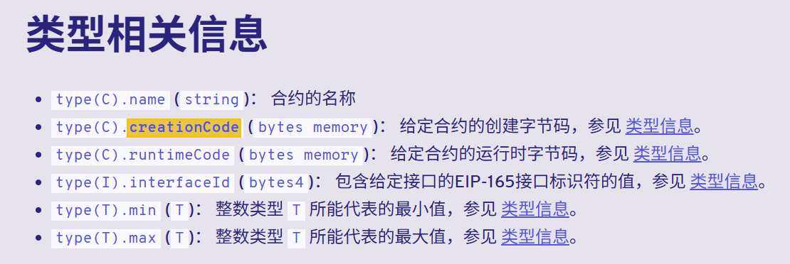

# Create2

CREATE2 不是随便起的名字，它是以太坊在 EIP-1014（2019 年君士坦丁堡升级）里引入的一种 专门的合约部署指令。
create 地址不可预知（除非你知道部署者 nonce），所以无法提前写死地址,合约地址由 keccak256(rlp(sender, nonce)) 决定，和合约代码内容无关。
create2 地址可预计算，只要确定了 deployer + salt + init_code，合约地址就是确定的，和部署时机无关
官方介绍：https://docs.soliditylang.org/zh-cn/v0.8.24/control-structures.html#create2   


## 两种部署方式
### solidity 直接使用 直接通过new关键字部署，相比于create多了{salt}参数
返回合约类型，salt为bytes32
```solidity
D d = new D{salt: salt}(arg);
```


### Yul内联汇编
返回为为address类型，salt同样为为bytes32.
```solidity
  assembly {
      pair := create2(
        0,                  // 表示发送的wei的数据
        add(bytecode, 32),  // bytecode的起始位置
        mload(bytecode),    // bytecode的长度
        salt                // 盐，
        )
  }

```
solidityzhong bytes memeory 的内存结构为：前面32字节表示数据的长度，真实数据在32直接后面
```perl
| offset → | 0x00 ... 0x1f | 0x20 ...     |
| 内容     | length (n)    | 实际字节数据   |
```
所以，就有了
```solidity
create2(
  v, 
  p,  // 真实的数据位置，其实是需要 bytecode 的位置 加上32 。add(bytecode, 32)
  n,  // 表示的是取值的长度。整好直接加载 bytecode，首先读取到的就是长度。
  s
)
```

## 预测地址

```solidity
bytes32 hash = keccak256(abi.encodePacked(
    bytes1(0xff),  // 固定位一个字节
    address(this),  // 当前合约的地址
    salt,           // bytes32类型的盐
    keccak256(bytecode)  // bytecode的哈希。
));
address predictedAddress = address(uint160(uint256(hash)));
```
### bytecode
就是合约的创建字节码与参数的组合。
```solidity
bytes memory bytecode = abi.encodePacked(type(Deployed).creationCode,abi.encode(arg));
```

### 获取合约的创建字节码
```solidity
bytes memory bytecode = type(Deployed).creationCode; 
```

相关链接：https://docs.soliditylang.org/zh-cn/v0.8.24/cheatsheet.html#index-9   \
https://docs.soliditylang.org/zh-cn/v0.8.24/units-and-global-variables.html#meta-type

## 完整案例

```solidity
// SPDX-License-Identifier: GPL-3.0
pragma solidity ^0.8.24;
contract Deployed {
    uint public x;
    constructor(uint a) {
        x = a;
    }
}

contract C {

    function createDSalted(uint salt, uint arg) public {
        
        bytes32 s = bytes32(salt);
        bytes memory bytecode = abi.encodePacked(
                type(Deployed).creationCode,
                abi.encode(arg)
            );

        bytes32 hash = keccak256(abi.encodePacked(
            bytes1(0xff),
            address(this),
            s,
            keccak256(bytecode)
        ));
        address predictedAddress = address(uint160(uint256(hash)));

        // 用solidity的new + {salt:salt} 方式部署
        // Deployed deployed = new Deployed{salt: bytes32(salt)}(arg);
        // require(predictedAddress == address(deployed));

        // ---------
        // 使用内联汇编中create2部署
        address deployed;
        assembly {
            deployed := create2(0, add(bytecode, 32), mload(bytecode), s)
        }
        require(deployed != address(0), "CREATE2 failed");
        require(predictedAddress == deployed);
    }
}
```


