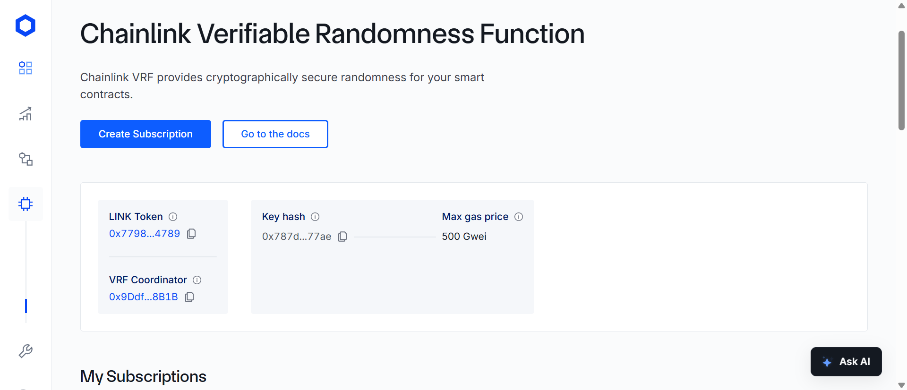
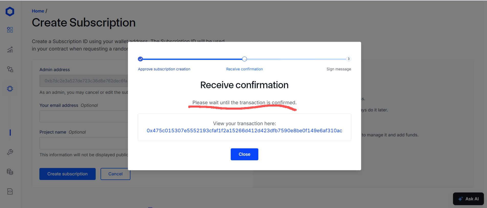
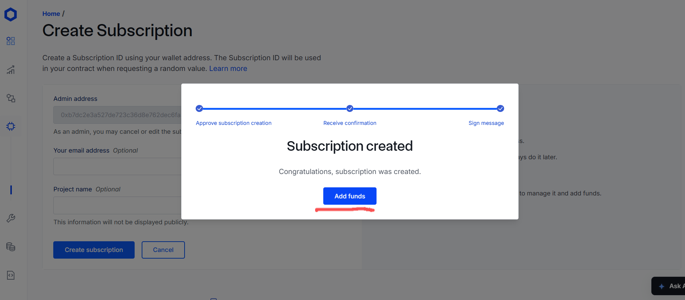
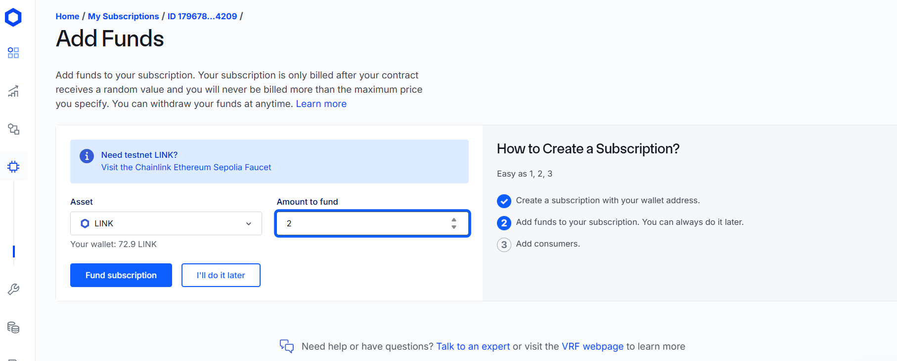
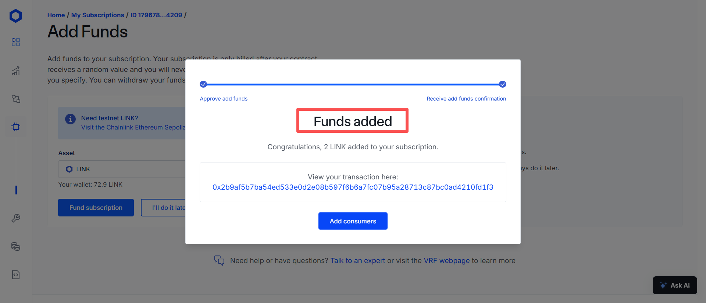
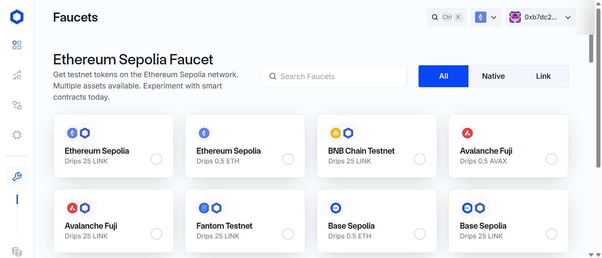

# Using VRF
[Official documentation](https://docs.chain.link/vrf/v2-5/getting-started)
The usage tutorial is under Getting Started
Look up the parameters for each network under Supported Networks

### Sample Code
[Remix sample code](https://remix.ethereum.org/#url=https://docs.chain.link/samples/VRF/v2-5/VRFD20.sol&autoCompile=true&lang=en&optimize&runs=200&evmVersion&version=soljson-v0.8.31+commit.fd3a2265.js)

### Triggering a Request and Generating a requestId
```solidity
uint256 requestId = s_vrfCoordinator.requestRandomWords(
    VRFV2PlusClient.RandomWordsRequest({
        keyHash: i_gasLane, // the maximum gas price tier
        subId: i_subscriptionId, // subscription id
        requestConfirmations: REQUEST_CONFIRMATIONS, // how many Chainlink nodes must confirm it
        callbackGasLimit: i_callbackGasLimit,  // the maximum gas the callback (fulfill) method may consume
        numWords: NUM_WORDS,               // the number of random words to request back
        extraArgs: VRFV2PlusClient._argsToBytes(
            VRFV2PlusClient.ExtraArgsV1({nativePayment: false})  // whether to pay with LINK or with eth
        )
    })
);
```
Detailed parameter explanations: https://docs.chain.link/vrf/v2-5/getting-started#contract-variables
Note also that different networks impose maximum limits on certain parameters


### Fulfilling the Random Words
```solidity
function fulfillRandomWords(
    uint256,
    uint256[] calldata randomWords
) internal override {
    uint256 indexOfWinner = (randomWords[0] % s_players.length);
    address payable winner = s_players[indexOfWinner];
    s_recentWinner = winner;
}
```

### Operating Instructions
#### Create a Subscription
Dashboard: https://vrf.chain.link/
Click Create Subscription

Fill in the corresponding information for email and program name, then click Create

The wallet pops up to sign, then wait for confirmation


#### Add Funds
Add LINK to the subscription


#### Add a Consumer
Add our contract address to the subscription as a consumer


### Faucet Address
https://faucets.chain.link/sepolia


### Installing Dependencies
Chainlink VRF 2.5 project repository: https://github.com/smartcontractkit/chainlink-brownie-contracts

```shell
forge install /smartcontractkit/chainlink-brownie-contracts
```

My own forked repository: https://github.com/minner-fun/chainlink-brownie-contracts/tree/fix/vrfV2_5Mock
Because the official V2_5Mock file throws a constructor-argument error, I made a small change and added an unused parameter to the constructor
```solidity
// lib\chainlink-brownie-contracts\contracts\src\v0.8\vrf\mocks\VRFCoordinatorV2_5Mock.sol
constructor(uint96 _baseFee, uint96 _gasPrice, int256 _weiPerUnitLink) SubscriptionAPI(msg.sender) {
i_base_fee = _baseFee;
i_gas_price = _gasPrice;
i_wei_per_unit_link = _weiPerUnitLink;
setConfig();
}

//lib\chainlink-brownie-contracts\contracts\src\v0.8\vrf\dev\SubscriptionAPI.sol
constructor(address _sender) ConfirmedOwner(msg.sender) {
address sender = _sender;
}
```

### Mock
You need to deploy VRFCoordinatorV2_5Mock and LinkToken. [Practical example](https://github.com/minner-fun/foundry-raffle/blob/main/script/HelperConfig.s.sol)

### Creating a Subscription, Funding It, and Adding a Consumer
When debugging on a local chain you need the full set of VRF functionality. [Practical example](https://github.com/minner-fun/foundry-raffle/blob/main/script/Interactions.sol)