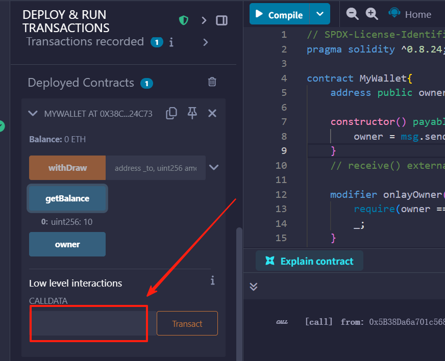
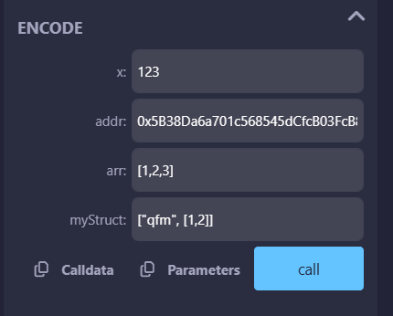
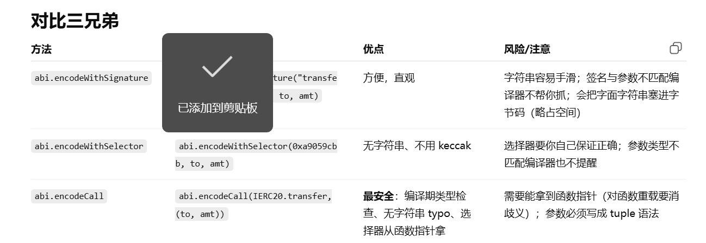
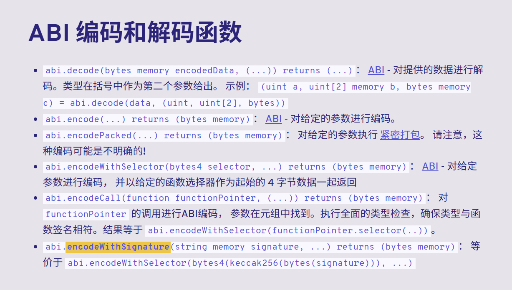

# 0. Members of `msg` and Methods of `address`
### `msg` members
```solidity
msg.data (bytes): the complete calldata
msg.sender (address): the message sender (of the current call)
msg.sig (bytes4): the first four bytes of the calldata (i.e. the function selector)
msg.value (uint): the amount of wei sent with the message
```

### address-related
Quick reference: https://docs.soliditylang.org/zh-cn/v0.8.24/units-and-global-variables.html#address-related
Details: https://docs.soliditylang.org/zh-cn/v0.8.24/types.html#members-of-addresses
```solidity
<address>.balance (uint256)
The balance of the address type, in wei.

<address>.code (bytes memory)
The code at the address type (can be empty).

<address>.codehash (bytes32)
The code hash of the address type.

<address payable>.transfer(uint256 amount)
Sends amount wei to the address type; throws on failure; forwards 2300 gas as the fee, not adjustable.

<address payable>.send(uint256 amount) returns (bool)
Sends amount wei to the address type; returns false on failure; forwards 2300 gas as the fee, not adjustable.

<address>.call(bytes memory) returns (bool, bytes memory)
Issues a low-level CALL with the given data; returns the success result and the returned data; forwards all available gas, adjustable.

<address>.delegatecall(bytes memory) returns (bool, bytes memory)
Issues a low-level DELEGATECALL with the given data; returns the success result and the returned data; forwards all available gas, adjustable.

<address>.staticcall(bytes memory) returns (bool, bytes memory)
Issues a low-level STATICCALL with the given data; returns the success result and the returned data; forwards all available gas, adjustable.
```

### `tx.origin`
https://docs.soliditylang.org/zh-cn/v0.8.24/units-and-global-variables.html#index-3
This is a global variable, similar to `msg.sender`, `msg....`, and the rest of the global variables.
```solidity
msg.sender  the caller one level up, which may be a contract or an externally owned account
tx.origin   the original external user
```

#### ⚠️ Security reminder
https://chatgpt.com/s/t_68dcb1734f7c819196f1e07050850866
As a matter of security practice, relying on `tx.origin` for access control is generally discouraged, because:
`tx.origin` makes a contract much more vulnerable to phishing attacks.
For example, an attacker's contract lures you into calling it, and then internally calls the target contract. At that point `tx.origin` is still you, but `msg.sender` is now the attacker's contract.

So the mainstream recommendation today is:

Use `msg.sender` for permission checks. Avoid relying on `tx.origin`.


# Contract Transfers

To make a contract able to receive ETH:
> 1. Define an ordinary `payable` method, or\
> 2. Provide a `receive` method, or a `payable` `fallback` method, or\
> 3. Make the constructor `payable`.
## `payable`
*In one sentence: if you want a method to be able to accept ETH when called, add the `payable` modifier to that function.*

Writing the constructor as `constructor() payable { ... }` is the correct form.\
Whether you need a `payable` constructor depends on whether you want to deposit funds at deployment time. If you want the contract to receive funds while running, remember to add `payable` to the receiving function or write a `receive()`.

`payable` is a modifier like `external` or `view`, so it goes after the function's `()`. Adding `payable` to the `constructor()` only lets the function accept ETH at deployment; it cannot accept ETH at any other time, because the constructor is only invoked at deployment. To let the contract receive funds while running, define the general-purpose `receive()` / `callback()` methods, or mark a specific function `payable`.

```solidity
// SPDX-License-Identifier: MIT
pragma solidity ^0.8.24;

contract SimplePay{

    // address payable owner;
    address owner;

    constructor(){
        owner = msg.sender;
        // owner = payable(msg.sender);
    }
    // The contract receives ETH.
    // As long as a method has payable, it can receive ETH;
    // it has nothing to do with whether owner in the constructor is payable.
    // If a specific address needs to receive a transfer, you need payable(address).
    function receiveEther() external payable{}
    // function receiveEther() external {}

    function queryBalance() external view returns(uint){
        return address(this).balance;
    }
}
```

## `fallback` and `receive`
Only an unexpected call after deployment is complete will trigger these functions.\
`receive`: designed specifically to receive ETH, so the definition of `receive` must carry the `payable` modifier.\
`fallback`: its main job is to handle calls that don't match any function signature. So without `payable` it can't handle an unexpected transfer call; with `payable` it can.

### Summary of the call order (EVM decision flow)

Call a specific function → it exists → execute normally\
Call a specific function → it doesn't exist\
Has data → trigger `fallback()`\
No data →\
If `receive()` is defined → trigger `receive()`\
Otherwise → trigger `fallback()`

`fallback`/`receive` are invoked because of an abnormal situation: the called function can't be found. Under normal conditions, all your logic methods still need to be written normally.


```solidity
// SPDX-License-Identifier: MIT
pragma solidity ^0.8.24;

contract MyToken {
    event Log(string funName, address sender, uint amount, bytes message);

    uint public a;
    function set(uint _a) public{
        a = _a;
    }
    receive() external payable{
        emit Log("receive", msg.sender, msg.value, "");
    }
    fallback() external payable{
        emit Log("fallback", msg.sender, msg.value, msg.data);
    }
}
```
### Can `receive` accept ETH sent in during deployment?

At deployment time, the construction code (the constructor) runs, not the runtime code. `receive()` / `fallback()` are only triggered after the contract has finished deploying and receives an external call.\
If you don't write a constructor, the compiler generates a default non-payable constructor;\
if the deployment transaction carries value, the check inserted by the compiler will make the transaction revert directly.\
Because during the "creation phase" the contract has no runtime code yet, `receive()`/`fallback()` simply don't exist, so of course they won't be called.

#### Correct form: you must explicitly write a `payable` constructor

```solidity
// SPDX-License-Identifier: MIT
pragma solidity ^0.8.24;

contract MyToken {
    // Allow ETH to be attached to the deployment transaction
    constructor() payable {}

    receive() external payable {}
    function sendViaCall(address payable _to, uint amount) external {
        (bool ok, ) = _to.call{value: amount}("");
        require(ok, "call failed");
    }
}

```


## Sending ETH
https://docs.soliditylang.org/zh-cn/v0.8.24/units-and-global-variables.html#address-related
Official documentation.
```solidity
<address payable>.transfer(uint256 amount)
Sends amount wei to the address type; throws on failure; forwards 2300 gas as the fee, not adjustable.

<address payable>.send(uint256 amount) returns (bool)
Sends amount wei to the address type; returns false on failure; forwards 2300 gas as the fee, not adjustable.

<address>.call(bytes memory) returns (bool, bytes memory)
Issues a low-level CALL with the given data; returns the success result and the returned data; forwards all available gas, adjustable.

// transfer and send have different return values; transfer returns nothing
payable(msg.sender).transfer(amount); // the current contract sends the Ether amount to the msg.sender

bool success = payable(msg.sender).send(address(this).balance);
require(success, "Send failed");

(bool success, ) = payable(msg.sender).call{value: address(this).balance}("");
require(success, "Call failed");

```

The logic behind `transfer`/`send` versus `call` amounts to hardcoding the gas parameter to 2300 and then calling `call`.\
So because of the gas restriction in `transfer`/`send`, there are many hidden pitfalls when gas isn't enough.
```solidity
// transfer
(bool ok, ) = _to.call{value: amount, gas: 2300}("");

// send
(bool ok, ) = _to.call{value: amount, gas: 2300}("");

// call
(bool ok, ) = _to.call{value: amount, gas: unlimited}("");
(bool ok, ) = _to.call{value: amount}(""); // more common, no gas specified
```
If the one calling `transfer`/`send` is an EOA, an ordinary externally owned account, there's no problem. But if the one calling `transfer`/`send` is\
a contract address, and someone has written overly gas-consuming logic in `receive` or `fallback`, then the whole call will fail because gas runs out.\
As we know, when you call a contract's method but don't name a function selector — that is, when the data is empty —\
the EVM automatically decides whether to execute `receive` or `fallback`. And `receive` / `fallback` is exactly this kind of call.

```solidity
// SPDX-License-Identifier: MIT
pragma solidity ^0.8.24;
contract MyToken{

    receive() external payable{}
    function sendViaTransfer(address payable _to, uint amount) external {
        _to.transfer(amount);  // here ETH is transferred from the contract to the _to address.
    }
    function sendViaSend(address payable _to, uint amount) external{
        bool sended = _to.send(amount);  // returns a boolean
        require(sended, "Failed to send Ether");
    }
    function sendViaCall(address payable _to, uint amount) external{
        (bool success, ) = _to.call{value: amount}("");  // the {} braces hold the amount value passed in
        require(success, "Failed to send Ether");
    }
}
```

## ETH Wallet Example

```solidity
// SPDX-License-Identifier: MIT
pragma solidity ^0.8.24;

contract MyWallet{
    address public owner;

    constructor() payable{ // using a payable constructor, ETH can be transferred in at deployment
        owner = msg.sender;
    }
    // receive() external payable{}  

    modifier onlayOwner(){
        require(owner == msg.sender, "musu owner can do this");
        _;
    }

    function withDraw(address payable _to, uint amount) external onlayOwner{
        (bool sended,) = _to.call{value: amount}("");
        require(sended, "send failue");
    }

    function getBalance() public view returns(uint){
        return address(this).balance;
    }
}
```

## UI Operations
Used to pass data into `msg.data`; this is mainly used by the `receive` and `fallback` functions.

### Setting the amount sent to the contract


# 2. Calling Other Contracts
## Basic Approach
You need the source of the called contract. Treat the called contract as a contract data type, create an instance of that contract type inside the other contract, and at call time pass in the called contract's address, instantiate the contract, and then invoke its methods.
### Approach 1: pass in the contract address, specifying the contract type at the parameter-type position
### Approach 2: pass in an address with parameter type `address`, then instantiate at call time
```solidity
// SPDX-License-Identifier: MIT
pragma solidity ^0.8.24;

contract MyTarget{

    uint public x;
    function setX(uint _x) public{
        x = _x;
    }
    function getX() public view returns(uint){
        return x;
    }
    function setXandE(uint _x) public payable{
        x = _x;
    }
    function getXandV() public view returns(uint, uint){
        uint val = address(this).balance;
        return (x, val);
    }
}


contract MyCaller{
    function cllTargetX(MyTarget target, uint _x) external{ // approach 1: specify the contract type at the parameter
        target.setX(_x);
    }
    function callTargetGet(address target) external view returns(uint){
        return MyTarget(target).getX();  // approach 2: pass in an address, instantiate at call time
    }
    function callTargetSetXandE(address target, uint _x) external payable{
        MyTarget(target).setXandE{value: msg.value}(_x);  // the way to pass value to msg, written inside the braces
    }
    function callTargetXandV(address adr) external view returns(uint, uint){
        (uint x, uint v) = MyTarget(adr).getXandV();
        return (x,v);
    }
}
```


## interface
Given contract A's address, declare in an interface the function declarations that contract A contains (you certainly don't need to give the concrete logic). Then you can invoke contract A's methods from inside another function.
Essentially, you use the interface structure to provide the function information of the contract.
It's similar to the second approach in the basic methods above, just replacing the original contract type with an interface.
```solidity
// SPDX-License-Identifier: MIT
pragma solidity ^0.8.24;

interface IConter{
    function get() external view returns(uint256);
    function add() external;
}

contract Call{
    function callGet(address conter) public view returns(uint256){
        return IConter(conter).get();
    }
    function callSet(address conter) public{
        IConter(conter).add();
    } 
}

// SPDX-License-Identifier: MIT
pragma solidity ^0.8.24;

contract Conter{
    uint public num;
    function get() external view returns(uint){
        return num;
    }
    function add() external {
        num += 1;
    }
}
```

## Calling Other Contracts with `call`
A more general, low-level calling method. It calls via calldata, and returns whether the call succeeded along with the function's return value as a bytes type.
Note the syntax:
```solidity
(bool success, bytes memory _data) = target.call(abi.encodeWithSignature(signature, _fooNum, _fooMessage));
(bool success, bytes memory _data) = target.call(abi.encodeWithSelect(function select, _fooNum, _fooMessage));
(bool success, bytes memory _data) = target.call(abi.encodeCall(function point, (_fooNum, _fooMessage)));
(bool success, bytes memory _data) = target.call(abi.encodeCall{value:xxx, gas: 1000000}("")); // the order of value and gas doesn't matter
(bool success, bytes memory _data) = target.call(abi.encodeCall(""));
```

Full example:
```solidity
// SPDX-License-Identifier: MIT
pragma solidity ^0.8.24;
contract MyToken {
    uint public num;
    string public message;
    event Log(string message);

    function foo(uint _num, string memory _message) external payable {
        num = _num;
        message = _message;
    }

    receive() external payable { 
        emit Log("receive was called");
    }

    fallback() external payable { 
        emit Log("fallback wass called");
    }

}

interface IMyToken {
    function foo(uint _num, string memory _message) external payable;
}

contract Call{

    constructor() payable{}

    bytes public data;

    function callWithContract(address payable target, uint _fooNum, string memory _fooMessage) public {
        MyToken(target).foo{value:100}(_fooNum, _fooMessage);
    }

    function callWithParam(MyToken target, uint _fooNum, string memory _fooMessage) public {
        target.foo{value:100}(_fooNum, _fooMessage);
    }

    function callWithInterface(address payable target, uint _fooNum, string memory _fooMessage) public {
        IMyToken(target).foo{value:100}(_fooNum, _fooMessage);
    }
    function callWithSignature(address target, uint _fooNum, string memory _fooMessage) public {
        (bool success, bytes memory _data) = target.call{value:100}(abi.encodeWithSignature("foo(uint256,string)", _fooNum, _fooMessage));
        require(success, "call failed");
        data = _data;
    }
    function callWithSelect(address target, uint _fooNum, string memory _fooMessage) public{
        (bool success, bytes memory _data) = target.call{value:100}(abi.encodeWithSelector(bytes4(keccak256(bytes("foo(uint256,string)"))), _fooNum, _fooMessage));
        require(success, "call failed");
        data = _data;
    }
    function callWithCall(address target, uint _fooNum, string memory _fooMessage) public {
        (bool success, bytes memory _data) = target.call{value:100}(abi.encodeCall(IMyToken(target).foo, (_fooNum, _fooMessage)));
        require(success, "call failed");
        data = _data;
    }
    function noneCallWithData(address target, uint _none) public {
        (bool success, bytes memory _data) = target.call{value:100}(abi.encodeWithSignature("none(uint256)", _none));
        require(success, "none call failed");
        data = _data;
    }
    function noneCallWithNone(address target) public {
        (bool success, bytes memory _data) = target.call{value:100}("");
        require(success, "none call failed");
        data = _data;
    }
}
```


## delegatecall
Unlike `call`, it only uses the code at the given address; all other aspects (storage, balance, …) are taken from the current contract. (So `delegatecall` doesn't need to transfer ether.)\
The purpose of `delegatecall` is to use library code stored in another contract. Users must ensure that the storage layouts in both contracts are suitable for `delegatecall`.
`delegatecall` causes variables to be stored in the calling contract itself. The order of the state variables in the calling contract and the called contract must correspond.
https://docs.soliditylang.org/zh-cn/v0.8.24/introduction-to-smart-contracts.html#index-13

#### Take special note: `delegatecall` cannot pass `{value:xxx,gas:xxx}`
```solidity
// the way arguments are passed is exactly the same as call
(bool success, bytes memory _data) = target.delegatecall(abi.encodeWithSelector(Callee.set.selector, _num));
```


## staticcall
Since Byzantium, `staticcall` is also available. This is basically the same as `call`, but it reverts if the called function modifies state in any way.
In other words, `staticcall` can only query data from a third contract; it's mainly for querying and has no permission to modify.
https://chatgpt.com/s/t_68a04cc99eac8191ade24b3175a639de

#### Take special note: `staticcall` also cannot pass `{value:xxx,gas:xxx}`


## `delegatecall` and `staticcall` Example
```solidity
// SPDX-License-Identifier: MIT
pragma solidity ^0.8.24;

contract Callee {
    uint256 public num;
    function set(uint256 _num) public payable returns(uint){
        num = 3 * _num;
        return num;
    }
    function get() public view returns(uint){
        return num;
    }
}

contract Caller {
    uint public num;    // this must correspond to the state variable declaration order of the called contract
    bytes public data;  // extra variables go below

    function setNum(address target, uint256 _num) public{
        (bool success, bytes memory _data) = target.delegatecall(abi.encodeWithSelector(Callee.set.selector, _num));
        require(success, "call failed");
        data = _data;
    }
    function setNumWithSignature(address target, uint256 _num) public{
        (bool success, bytes memory _data) = target.delegatecall(abi.encodeWithSignature("set(uint256)", _num));
        require(success, "call failed");
        data = _data;
    }
    function staticcallWithNone(address target) public {
        (bool success, bytes memory _data) = target.staticcall(abi.encodeWithSignature("get()"));
        require(success, "call failed");
        data = _data;
    }
    // errors out, staticcall cannot modify content
    function staticcallWithNum(address target, uint256 _num) public{
        (bool success, bytes memory _data) = target.staticcall(abi.encodeWithSignature("set(uint256)", _num));
        require(success, "call failed");
        data = _data;
    }
}
```


# Encoding and Decoding

### Keccak256 Hash Function
Keccak256 requires a bytes-type input, so you need to encode the arguments into bytes.
Use `abi.encode` and `abi.encodePacked` to encode.
Difference: `abi.encode` retains more information and pads with zeros;
       `abi.encodePacked` compresses the data, keeping only the non-zero data.

Keccak256 hash collisions
Because when `encodePacked` encodes `('aaa','bbb')` versus `('aa', 'abbb')`, due to compression the returned results are the same, so after being hashed by keccak256 the results are identical. That's a hash collision.
Of course, `encode` doesn't have this problem; it pads with many zeros by itself, so different inputs are different.
Solution: just add one extra parameter to the `encodePacked` arguments — `('aaa','bbb')` => `('aa', 2, 'abbb')`, which is obviously now different.

```solidity
// SPDX-License-Identifier: MIT
pragma solidity ^0.8.3;


 // Summary: to handle hash collisions, if you use the encodePacked method, you need to insert an extra parameter directly between the two parameters.
 // If it's encode, you don't need to.

contract HashFunc {
    function hash(
        string memory text,
        uint256 num,
        address addr
    ) external pure returns (bytes32) {
        // keccak256 takes a bytes type, so you need to encode or encodePacked first
        return keccak256(abi.encodePacked(text, num, addr));
        // abi.encode
    }

    function collision(string memory text0, string memory text1)
        external
        pure
        returns (bytes32)
    {
        return keccak256(abi.encode(text0, text1));
    }

    function collision_2(string memory text0, string memory text1)
        external
        pure
        returns (bytes32)
    {
        return keccak256(abi.encodePacked(text0, text1));
    }

    function encode(string memory text0, string memory text1)
        external
        pure
        returns (bytes memory)
    {
        return abi.encode(text0, text1); // the generated value is padded with zeros
    }

    function encodePacked(string memory text0, string memory text1)
        external
        pure
        returns (bytes memory)
    {
        return abi.encodePacked(text0, text1); // the compressed result; there's a problem: inputting the two args 'aaa' 'bbb' gives the same result as inputting 'aa' 'abbb', which is problematic, so you need a parameter in between
    }
}

```


### Function Selector, Signature, and Function Pointers
https://chatgpt.com/s/t_689bf423aba88191aa996d9944bc3926  
#### signature 
The function signature is `"functionName(parameterTypeList)"`.
```
"transfer(address,uint256)"
```

#### function selector: 
Take the function signature (`functionName(parameterTypeList)`, with no spaces) and apply keccak256, then take the first 4 bytes. Or use the function pointer's `.selector`.
```solidity
bytes4(keccak256(bytes(signature))
IOverload.foo.select
```
#### Function pointers
In Solidity, a function is itself a kind of object and can be referenced using the form *ContractName.functionName*.
Such a reference is called a function pointer. A function pointer is the function itself — the definition of a not-yet-executed function.

```solidity
interface IOverload {
    function foo(uint256) external returns (uint256);
    function foo(string calldata) external returns (bytes32);
}

abi.encodeCall(IOverload.foo(string), ("hi"));      // ✅

// Approach 2: declare a function pointer variable first, then pass it
function(uint256) external returns (uint256) fp = IOverload.foo;
abi.encodeCall(fp, (123));
```

### `msg.data` and calldata
In Solidity, `msg.data` represents the complete calldata of the current external call — that is, the raw byte data sent by the caller (an EOA or a contract) to the current contract.
> "When the EVM calls this function of mine, all the raw argument data it passes in (including the function selector + the encoded arguments)."

When you call a contract function using the ABI encoding rules, the structure of `msg.data` is usually:
```
[ 4-byte function selector ][ encoded arg1 ][ encoded arg2 ] ...
```


Full example:
```solidity
// SPDX-License-Identifier: MIT
pragma solidity ^0.8.23;

contract FunctionSelector {
    function getSelector(string calldata _func) external pure returns (bytes4) {
        return bytes4(keccak256(bytes(_func)));  // bytes4 takes the first 8 characters; after processing "transfer(address,uint256)" you get 0xa9059cbb
    }                                                 //  note that the "" must also be entered together, and uint256 cannot be abbreviated to uint at all — this is encryption over the characters, so an abbreviation makes the characters different
    function getSelector2(string calldata _func) external pure returns (bytes4) {
        return bytes4(keccak256(abi.encode(_func)));
    }
    function getTest(string calldata _func) external pure returns(bytes memory, bytes memory){
        return (bytes(_func),abi.encodePacked(_func));
        // but the result of encodePacked may be the same as the result after bytes; we won't study this deeply here for now
    }
}


// proving the structure of msg.data
//0xa9059cbb 0000000000000000000000005b38da6a701c568545dcfcb03fcb875f56beddc4 000000000000000000000000000000000000000000000000000000000000007b
contract Receiver {
    event Log(bytes data);
    event TLog(bytes indexed data, address indexed addr, uint indexed num);

    function transfer(address _to, uint256 _amount) external {
        emit Log(msg.data);
        emit TLog(msg.data, _to, _amount);
    }
}

```

### `abi.encode` and `abi.decode`
One encodes, the other decodes.
`abi.encode(...)` produces the complete standard ABI encoding.
`abi.decode(...)` works precisely because `abi.encode` includes length information, offset information, and padding. So `decode` can parse it correctly.
Whereas `abi.encodePacked` is merely the byte transcoding of each parameter concatenated together, so it can't be decoded by `decode`. It's irreversible, unrecoverable data.

When passing in a struct, you still use `[]` square brackets.
`abi.encode(x, addr, arr, myStruct); // just put the various variables in directly`

`(x, addr, arr, myStruct) = abi.decode(data,(uint256, address, uint256[], MyStruct)); // note the decode method has two parameters; the second is used to specify the data types, wrapped in parentheses`

#### Full example
```solidity
// SPDX-License-Identifier: MIT
pragma solidity ^0.8.23;

contract AbiDecode {
    struct MyStruct {
        string name;
        uint256[2] nums;
    }

    function encode(
        uint256 x,
        address addr,
        uint256[] calldata arr,
        MyStruct calldata myStruct
    ) external pure returns (bytes memory) {
        return abi.encode(x, addr, arr, myStruct); // just put the various variables in directly
    }

    function decode(bytes calldata data)
        external
        pure
        returns (
            uint256 x,
            address addr,
            uint256[] memory arr,
            MyStruct memory myStruct
        )
    {
        (x, addr, arr, myStruct) = abi.decode(data,(uint256, address, uint256[], MyStruct)); // note the decode method has two parameters; the second is used to specify the data types, wrapped in parentheses
    }
}

```



### `abi.encode` vs `abi.encodePacked` vs `bytes` vs `bytes.concat`

`abi.encode` includes length information, offset information, and padding; it's the standard ABI encoding, encoding the arguments to generate calldata used to pass information between contracts.
`abi.encodePacked` compresses the data; you can think of it as separately converting each parameter to bytes and then concatenating them.
```solidity
// the result after abi.encode
0x
0000000000000000000000000000000000000000000000000000000000000020  // offset
0000000000000000000000000000000000000000000000000000000000000022  // length 0x22 = 34
7472616e7366657228616464726573732c75696e7432353629                 // the raw string
00000000000000000000000000000000000000000000000000000000           // padding

// the result of encodePacked
0x7472616e7366657228616464726573732c75696e7432353629  // similar to the raw-string part after encode
```


The result of `abi.encodePacked("aaa", "bbb", "ccc")` is to convert each of "aaa", "bbb", "ccc" into raw UTF-8 bytes and then concatenate them directly — prone to hash collisions.\
Whereas `bytes.concat()` is specifically for concatenating multiple bytes together.
```solidity

bytes("aaa") = 0x616161
bytes("bbb") = 0x626262
bytes("ccc") = 0x636363

function encodePacked_and_bytes() public pure returns(bytes memory, bytes memory){
    bytes memory a;
    bytes memory b;
    a = abi.encodePacked("aaa", "bbb", "ccc");
    b = bytes.concat(bytes("aaa"), bytes("bbb"), bytes("ccc"));
    return (a, b);
}

a = b = 0x616161626262636363 // simply concatenated directly
```

### Keccak256
Called a hash function.
Input is `bytes memory`, output is `bytes32`.

#### Implicit conversion — string literals
```solidity
// this is because string literals (e.g. a directly written "...") get special treatment in Solidity: they can be implicitly converted to bytes memory
full2 = keccak256("transfer(address,uint256)");

// equivalent to
full2 = keccak256(bytes("transfer(address,uint256)"));
// also equivalent to:
full2 = keccak256(abi.encodePacked("transfer(address,uint256)"));

```
"Implicit conversion" only works for literals. It doesn't work for variables.
```solidity
string memory sig = "transfer(address,uint256)";
// ❌ won't work: a string variable won't automatically become bytes
full2 = keccak256(sig);
```
#### Common scenario
```solidity
bytes4(keccak256(bytes(_func))); // the way a function selector is generated
```

##### bytes
`_func` is a `string` type; a `string` in Solidity is actually a UTF-8-encoded dynamic byte array.
`bytes(_func)` converts this string into a pure byte sequence (a `bytes` type), without length information — it's the raw bytes of the string.
The hash computed by `keccak256(bytes(_func))` is exactly the computation over the "UTF-8 bytes of the function signature" required by the ABI function selector specification.
##### abi.encode
`abi.encode(...)` is ABI encoding; it treats `_func` as one argument and performs full ABI serialization, which adds extra metadata (length + padding), so it's no longer the raw string bytes.

##### Using `abi.encodePacked` and `bytes` produces equivalent output. They're interchangeable.
https://chatgpt.com/s/t_689bf5a081408191a8b6a15dee3370d6
https://chatgpt.com/s/t_68be4da094108191888072582f33704e


### `encodeWithSignature` vs `abi.encodeWithSelector` vs `abi.encodeCall`
>If you want "standard ABI encoding + compile-time type checking + no writing strings", use `abi.encodeCall`;\
>if you want to write the selector by hand, use `abi.encodeWithSelector`;\
>only use `abi.encodeWithSignature` if you really must use a string.

`abi.encodeWithSignature`: directly takes a function-name string like `"transfer(address,uint256)"` as input and encodes it; such a function name is called the function signature.
`abi.encodeWithSelector`: takes a function selector as input and encodes it.
`abi.encodeCall`: parameter: `functionPointer` must be an external function pointer (usually a function reference from an interface or contract); the second argument puts all the actual arguments into a single tuple (written as `(arg1, arg2, ...)`).
```solidity
abi.encodeWithSignature(string memory signature, ...) returns (bytes memory)
```
is equivalent to
```solidity
abi.encodeWithSelector(bytes4(keccak256(bytes(signature))), ...)
```
is equivalent to
```solidity
abi.encodeCall(function functionPointer, (...)) returns (bytes memory)
```

The `signature` in the code above is `"transfer(address,uint256)"`.
So the function selector is
```solidity
bytes4(keccak256(bytes(signature))
```
`function functionPointer` is the function pointer; for overloaded cases you distinguish by the concrete arguments.

#### For an overloaded function in `encodeCall`, you need to manually spell out the parameter types to disambiguate
```solidity
interface IOverload {
    function foo(uint256) external returns (uint256);
    function foo(string calldata) external returns (bytes32);
}

// Approach 1: annotate the signature on the type
abi.encodeCall(IOverload.foo, (123));               // ❌ ambiguous
abi.encodeCall(IOverload.foo(uint256), (123));      // ✅

abi.encodeCall(IOverload.foo(string), ("hi"));      // ✅

// Approach 2: declare a function pointer variable first, then pass it
function(uint256) external returns (uint256) fp = IOverload.foo;
abi.encodeCall(fp, (123));                          // ✅

```



#### Real-world example
GPT says it recommends `encodeCall`, claiming it saves gas and has validation, but I found this one is actually the most expensive.

```solidity
// SPDX-License-Identifier: MIT
pragma solidity ^0.8.24;

interface IERC20{
    function transfer(address _to, uint amount) external;
}

contract DataEncode{
    // 1459
    function encodeWithsign(address _to, uint amount) external pure returns(bytes memory){
        return abi.encodeWithSignature("transfer(address,uint256)", _to, amount);  // just pass in the string directly
    }
    // 1493
    function encodeWithselect(address _to, uint amount) external pure returns(bytes memory){
        return abi.encodeWithSelector(IERC20.transfer.selector, _to, amount);    // needs the source to obtain the selector
    }
    // 1506
    function encodeCall(address _to, uint amount) external pure returns(bytes memory){
        return abi.encodeCall(IERC20.transfer, (_to, amount));    // here the arguments are placed into one parameter slot; this also needs the selector
    }
}
```

### The Three Encoding Methods vs `abi.encode` / `abi.encodePacked`

The three methods generate calldata, and this calldata is the called contract's `msg.data`.
The data structure of calldata is also: function selector + ABI encoding of the arguments.
```solidity
// for intuitive understanding; the internal implementation is certainly not like this.
bytes.concat(sel, abi.encode(a, b, c)) == aib.encodePacked(sel, abi.encode(a, b, c)) // here encodePacked also only serves to concatenate 
abi.encodeWithSelector(sel, a, b, c) == bytes.concat(sel, abi.encode(a, b, c)); // concatenates the bytes of the function selector with the bytes of the arguments

abi.encodeWithSignature("f(uint256,address)", x, y) == abi.encodeWithSelector(bytes4(keccak256("f(uint256,address)")), x, y);

abi.encodeCall(IFace.f, (x, y)) == abi.encodeWithSelector(IFace.f.selector, x, y);
```

So you can intercept it in `fallback`: after stripping out the first four bytes of `msg.data`, you can decode the rest with `abi.decode()`.
```solidity
fallback() external payable {
    bytes4 sel = msg.sig;                     // the first 4-byte selector
    // assume we know the parameter types:
    (address to, uint256 amt) = abi.decode(msg.data[4:], (address, uint256));
}
```
```solidity
function test(uint256 x, string memory s)
    public
    pure
    returns (
        bytes memory,
        bytes memory,
        bytes memory,
        bytes memory,
        bytes memory,
        bytes memory
    )
{
    bytes4 sel = bytes4(keccak256("foo(uint256,string)"));

    bytes memory a = abi.encodeWithSelector(sel, x, s);
    bytes memory b = bytes.concat(sel, abi.encode(x, s));
    bytes memory c = abi.encodePacked(sel, abi.encode(x, s));
    bytes memory d = abi.encodeWithSignature("foo(uint256,string)", x, s);
    bytes memory e = abi.encodeCall(MyToken.foo, (x, s));
    bytes memory f = abi.encodeCall(IMyToken.foo, (x, s));

    return (a, b, c, d, e, f);
}
```

https://docs.soliditylang.org/zh-cn/v0.8.24/cheatsheet.html#abi
Haven't done the multisig wallet yet; need to understand the 721 code, which would help better understand the two auctions.
