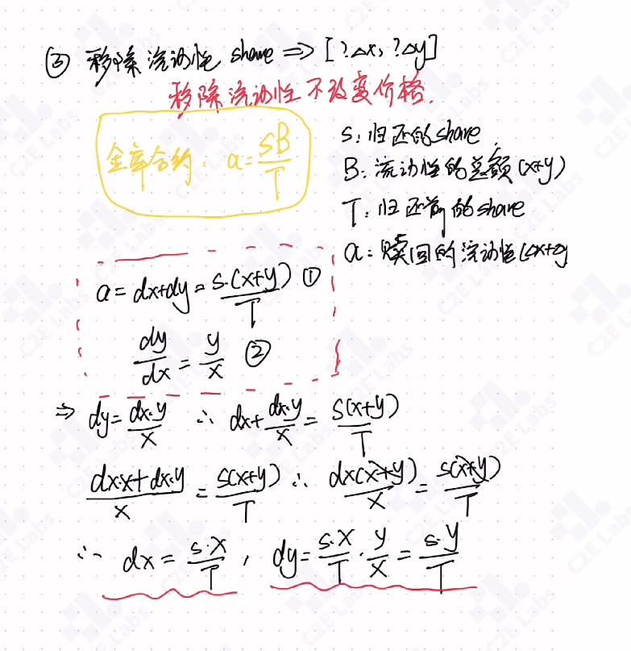
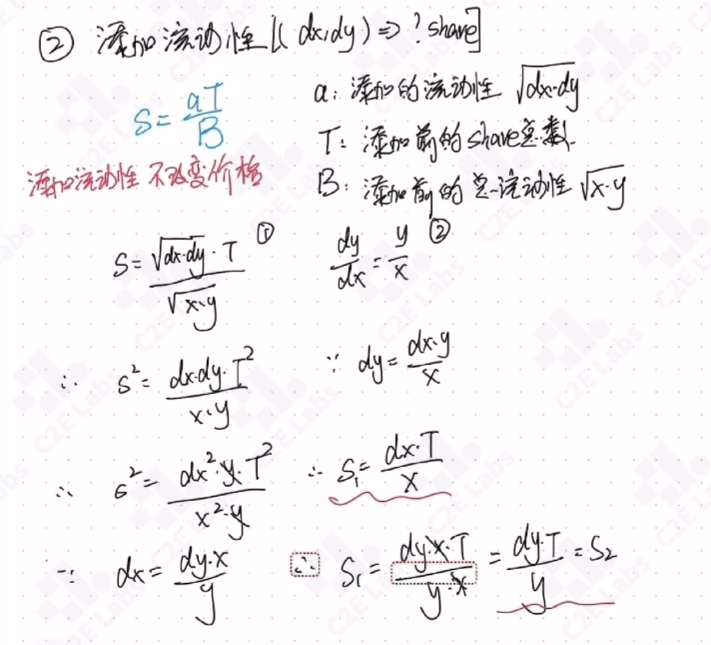
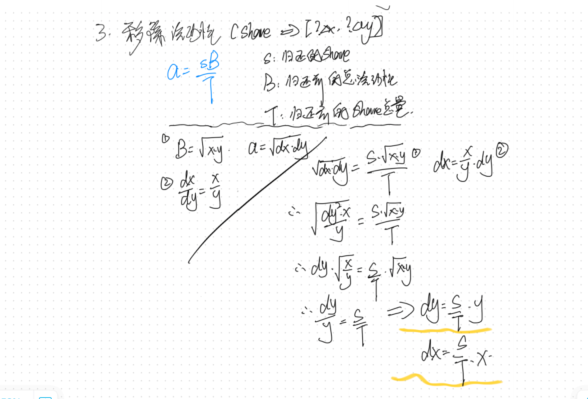

# Additional Cases

## Various Ways to Use call
```solidity
// SPDX-License-Identifier: MIT
pragma solidity ^0.8.24;

contract MyToken {
    uint256 public num;
    string public message;
    event Log(string message);

    function foo(uint256 _num, string memory _message) external payable {
        num = _num;
        message = _message;
    }

    receive() external payable {
        emit Log("receive was called");
    }

    fallback() external payable {
        emit Log("fallback wass called");
    }
}

interface IMyToken {
    function foo(uint256 _num, string memory _message) external payable;
}

contract Call {
    constructor() payable {}

    bytes public data;

    function callWithContract(
        address payable target,
        uint256 _fooNum,
        string memory _fooMessage
    ) public {
        MyToken(target).foo{value: 100}(_fooNum, _fooMessage);
    }

    function callWithParam(
        MyToken target,
        uint256 _fooNum,
        string memory _fooMessage
    ) public {
        target.foo{value: 100}(_fooNum, _fooMessage);
    }

    function callWithInterface(
        address payable target,
        uint256 _fooNum,
        string memory _fooMessage
    ) public {
        IMyToken(target).foo{value: 100}(_fooNum, _fooMessage);
    }

    function callWithSignature(
        address target,
        uint256 _fooNum,
        string memory _fooMessage
    ) public {
        (bool success, bytes memory _data) = target.call{value: 100}(
            abi.encodeWithSignature("foo(uint256,string)", _fooNum, _fooMessage)
        );
        require(success, "call failed");
        data = _data;
    }

    function callWithSelect(
        address target,
        uint256 _fooNum,
        string memory _fooMessage
    ) public {
        (bool success, bytes memory _data) = target.call{value: 100}(
            abi.encodeWithSelector(
                bytes4(keccak256(bytes("foo(uint256,string)"))),
                _fooNum,
                _fooMessage
            )
        );
        require(success, "call failed");
        data = _data;
    }

    function callWithCall(
        address target,
        uint256 _fooNum,
        string memory _fooMessage
    ) public {
        (bool success, bytes memory _data) = target.call{value: 100}(
            abi.encodeCall(IMyToken(target).foo, (_fooNum, _fooMessage))
        );
        require(success, "call failed");
        data = _data;
    }

    function noneCallWithData(address target, uint256 _none) public {
        (bool success, bytes memory _data) = target.call{value: 100}(
            abi.encodeWithSignature("none(uint256)", _none)
        );
        require(success, "none call failed");
        data = _data;
    }

    function noneCallWithNone(address target) public {
        (bool success, bytes memory _data) = target.call{value: 100}("");
        require(success, "none call failed");
        data = _data;
    }

    function callWitnSelfHsah(
        address _target,
        uint256 _value,
        uint256 _num,
        string memory _message
    ) public {
        bytes memory data_tmp = abi.encodePacked(
            bytes4(keccak256(bytes("foo(uint256,string)"))),
            abi.encode(_num, _message)
        );
        (bool success, bytes memory _data) = _target.call{value: _value}(
            data_tmp
        );
        require(success, "faile");
        data = _data;
    }
    // All of these are equivalent
    function test(uint256 x, string memory s)
        public
        pure
        returns (
            bytes memory,
            bytes memory,
            bytes memory,
            bytes memory,
            bytes memory,
            bytes memory
        )
    {
        bytes4 sel = bytes4(keccak256("foo(uint256,string)"));

        bytes memory a = abi.encodeWithSelector(sel, x, s);
        bytes memory b = bytes.concat(sel, abi.encode(x, s));
        bytes memory c = abi.encodePacked(sel, abi.encode(x, s));
        bytes memory d = abi.encodeWithSignature("foo(uint256,string)", x, s);
        bytes memory e = abi.encodeCall(MyToken.foo, (x, s));
        bytes memory f = abi.encodeCall(IMyToken.foo, (x, s));

        return (a, b, c, d, e, f);
    }
}

```


## Vault Contract

### Core Principle
Whatever percentage of funds you add, you mint that same percentage of shares.

$$
\begin{aligned}
\frac{a + B}{B} = \frac{s + T}{T}
\end{aligned}
$$

Derivation

$$
\begin{aligned}
\frac{a}{B} = \frac{s}{T} \quad \Leftrightarrow \quad aT = sB
\end{aligned}
$$

Add funds, receive shares

$$
\begin{aligned}
s = \frac{a * T}{B} \quad \Leftrightarrow \quad s = \frac{a}{B} *  T 
\end{aligned}
$$

Burn shares, redeem funds

$$
\begin{aligned}
a = \frac{s * B}{T} \quad \Leftrightarrow \quad a = \frac{s}{T} *  B
\end{aligned}
$$


### Inflation Attack
**Key idea: it exploits Solidity's floor-division (rounding down) behavior, combined with a direct `transfer` that bypasses the share accounting.**
When the result of a calculation is a fraction, since Solidity has no floating-point numbers, it rounds down, dropping the fractional part entirely. So 0.xxx simply becomes 0.
```solidity
function get(uint a, uint b) public pure returns(uint){
    return a/b;
}
```
Attack flow: the attacker first deposits a tiny amount and receives a small number of shares. Then, using a direct `transfer`, they send a huge amount of funds to the contract, inflating the contract's `B`. As we saw above, `s` is computed as the product `a * T` divided by `B`, so as long as `B` is large enough, the newly computed `s` becomes a fraction, which Solidity rounds down to 0. As a result, a new user receives no shares at all. When the attacker withdraws, `a = s * B / T`; since no other user has ever received any shares, the total supply `T = s`, so `a = B`. In the end, all of the funds in the vault belong to the attacker.

### Mitigations
1. Track each account's balance with a dedicated state variable.  
2. Have the contract make the first deposit itself.   

### Full Code
```solidity
// SPDX-License-Identifier: MIT

pragma solidity ^0.8.24;

import {IERC20} from "../common/IERC20.sol";

contract Vault {
    IERC20 public immutable TOKEN;
    uint256 public totalSupply;
    mapping(address => uint) public balanceOf;
    constructor(address _token){
        TOKEN = IERC20(_token);
    }

    function _mint(address _to, uint _share) private{
        totalSupply += _share;
        balanceOf[_to] += _share;
    }

    function _burn(address _from, uint _share) private{
        totalSupply -= _share;
        balanceOf[_from] -= _share;
    }

    // s = at/b
    function deposit(uint _amount) external {
        require(_amount > 0, "Amount must be greater than 0");
        uint share;
        if (totalSupply == 0){
            share = _amount;
        }else{
            share = _amount * totalSupply / TOKEN.balanceOf(address(this));
        }
        _mint(msg.sender, share);
        require(TOKEN.transferFrom(msg.sender, address(this), _amount), "tansfer failed");
    }
    // a = sb/t
    function withdraw(uint _share) external {
        require(_share > 0, "Shares must be greater than 0");
        uint amount = _share * TOKEN.balanceOf(address(this)) / totalSupply;
        _burn(msg.sender, _share);
        require(TOKEN.transfer(msg.sender, amount), "transfer failed"); 
    }
}
```

## Constant Sum Automated Market Maker

### A Few Core Principles
> Swaps do not change liquidity.  
> Adding or removing liquidity does not change the price.  


Liquidity: a token pair

$$
x + y
$$

Adding liquidity: what you add is a token pair — a pair of tokens

$$
△x + △y
$$

Price: the price simply ensures the exchange ratio between the two tokens stays the same

$$
\begin{aligned}
\frac{x + △x}{y + △y} = \frac{x}{y} \quad \Leftrightarrow \quad \frac{△x}{△y} = \frac{x}{y}
\end{aligned}
$$

### Formula Conclusions
#### Swap Relationship
However many `x` you provide, you can withdraw that many `y`.

$$
△x = △y
$$
#### Adding Liquidity
Provide `x`, `y` to receive shares

$$
\begin{aligned}
s = \frac{△x + △y}{x + y} * T
\end{aligned}
$$
This can be understood as:
$$
\begin{aligned}
s = α * T  \quad where \ α \ is \quad α = \frac{△x + △y}{x + y}
\end{aligned}
$$
#### Removing Liquidity

$$
\begin{aligned}
△x = \frac{s}{T} * x \quad, \quad △y = \frac{s}{T} * y
\end{aligned}
$$
This can be understood as:
$$
\begin{aligned}
△x = α * x \quad, \quad △y = α * y \quad, \quad
where \ α \ is \quad α = \frac{s}{T}
\end{aligned}
$$
### Derivation

#### Add-Liquidity Formula

#### Remove-Liquidity Formula

### Full Code
```solidity

// SPDX-License-Identifier: MIT


pragma solidity ^0.8.24;
contract CSAMM{
    IERC20 public immutable token0;
    IERC20 public immutable token1;

    uint public reserve0;
    uint public reserve1;

    uint public totalSupply;
    mapping(address => uint) public balanceOf;

    constructor(address _token0, address _token1){
        token0 = IERC20(_token0);
        token1 = IERC20(_token1);
    }

    function _mint(address _to, uint _amount) private {
        balanceOf[_to] += _amount;
        totalSupply += _amount;
    }

    function _burn(address _from, uint _amount) private {
        balanceOf[_from] -= _amount;
        totalSupply -= _amount;
    }

    function _update(uint _res0, uint _res1) private{
        reserve0 = _res0;
        reserve1 = _res1;
    }

    // dx = dy
    function swap(address _tokenIn, uint256 _amountIn) external returns(uint256 amountOut){
        require(_tokenIn == address(token0) || _tokenIn == address(token1), "invalid token");
        require(_amountIn > 0, "amount in = 0");
        bool isToken0 = _tokenIn == address(token0);
        (IERC20 tokenIn, IERC20 tokenOut, uint256 resIn) = isToken0 ? (token0, token1, reserve0) : (token1, token0, reserve1);
        require(tokenIn.transferFrom(msg.sender, address(this), _amountIn), "transfer failed");

        // Don't blindly trust _amountIn: the user might claim to send 100 tokens while fewer actually arrive. Computing from the amount actually received is more reliable.
        uint256 amountIn = tokenIn.balanceOf(address(this)) - resIn;

        amountOut = (amountIn * 997) / 1000;
        require(tokenOut.transfer(msg.sender, amountOut), "transfer failed");

        _update(token0.balanceOf(address(this)), token1.balanceOf(address(this)));
    }

    // The x and y in the formula are the reserves; the reserves represent the state before the transfer, and balanceOf gives the state after the transfer.
    // shares = (dx + dy)/(x + y) * T
    function addLiquidity(uint _amount0, uint _amount1) external returns(uint256 shares){
        require(token0.transferFrom(msg.sender, address(this), _amount0), "transfer failed");
        require(token1.transferFrom(msg.sender, address(this), _amount1), "transfer failed");

        uint256 bal0 = token0.balanceOf(address(this));
        uint256 bal1 = token1.balanceOf(address(this));

        uint256 d0 = bal0 - reserve0; // Compute how many tokens were actually deposited based on the amount actually received
        uint256 d1 = bal1 - reserve1;

        if (totalSupply > 0){
            shares =  (d0 + d1) * totalSupply / (reserve0 + reserve1);
        }else{
            shares = d0 + d1;
        }
        require(shares > 0, "shares = 0");
        _mint(msg.sender, shares);
        _update(bal0, bal1); // Refresh the current balances of the two tokens

    }
    // d0 = s/T * B
    function removeLiquidity(uint _shares) external returns(uint d0, uint d1){
        d0 = (reserve0 * _shares) / totalSupply;
        d1 = (reserve1 * _shares) / totalSupply;
        _burn(msg.sender, _shares);
        if (d0 > 0){
            require(token0.transfer(msg.sender, d0), "transfer failed");
        }
        if (d1 >0){
            require(token1.transfer(msg.sender, d1), "transfer failied");
        }
        _update(token0.balanceOf(address(this)), token1.balanceOf(address(this)));
    }

    // Manually update the reserves
    function sync() external {
        _update(token0.balanceOf(address(this)), token1.balanceOf(address(this)));
    }

} 

interface IERC20 {
    function totalSupply() external view returns (uint256);
    function balanceOf(address account) external view returns (uint256);
    function transfer(address recipient, uint256 amount)
        external
        returns (bool);
    function allowance(address owner, address spender)
        external
        view
        returns (uint256);
    function approve(address spender, uint256 amount) external returns (bool);
    function transferFrom(address sender, address recipient, uint256 amount)
        external
        returns (bool);
}
```

## Constant Product Automated Market Maker

$$
\begin{aligned}
x * y = k
\end{aligned}
$$

### Core Principles
Still the same:

> Swaps do not change liquidity.  
> Adding or removing liquidity does not change the price.  


### Formula Conclusions
#### Swap Relationship


$$
\begin{aligned}
△y = \frac{△x * y}{△x + x}
\end{aligned}
$$

This can be understood as:

$$
\begin{aligned}
△y = α * y  \quad where \ α \ is: \quad α = (1+ \frac{△x}{x})
\end{aligned}
$$
#### Adding Liquidity
Provide `x`, `y` to receive shares

$$
\begin{aligned}
s1 = \frac{△x}{x} * T \quad \Leftrightarrow \quad s1 = α * T \quad where \ α \ is: \quad α = \frac{△x}{x}
\end{aligned}
$$
Expressed in terms of `y`:
$$
\begin{aligned}
s2 = \frac{△y}{y} * T \quad \Leftrightarrow \quad s2 = α * T \quad where \ α \ is: \quad α = \frac{△y}{y}
\end{aligned}
$$
#### Removing Liquidity

$$
\begin{aligned}
△x = \frac{s}{T} * x \quad, \quad △y = \frac{s}{T} * y
\end{aligned}
$$
This can be understood as:
$$
\begin{aligned}
△x = α * x \quad, \quad △y = α * y \quad, \quad
where \ α \ is \quad α = \frac{s}{T}
\end{aligned}
$$


### Derivation

#### Swap Relationship


#### Adding Liquidity


#### Removing Liquidity




## Comparison: Vault, Constant Sum, Constant Product
|        | Swap Relationship | Adding Liquidity | Removing Liquidity |
|:------:|:--------:|:----------:|:----------:|
| Vault Contract   | none | $s=\frac{a}{B}\cdot T$ | $a=\frac{s}{T}\cdot B$ |
| Constant Sum AMM   | $\Delta y=\Delta x$ | $s=\frac{\Delta x+\Delta y}{x+y}\cdot T$ | $\Delta x=\frac{s}{T}\cdot x,\ \Delta y=\frac{s}{T}\cdot y$ |
| Constant Product AMM   | $\Delta y=\frac{\Delta x \cdot y}{\Delta x + x}$ | $s=\frac{\Delta x}{x}\cdot T =\frac{\Delta y}{y}\cdot T$ | $\Delta x=\frac{s}{T}\cdot x,\ \Delta y=\frac{s}{T}\cdot y$ |

## Summary
The swap relationships of constant-sum and constant-product AMMs each follow their own invariant (constant sum or constant product).  
For adding and removing liquidity, take each model's liquidity expression and add-liquidity expression, combine them with the price-invariance principle, and substitute into the vault contract's formula to compute the result.

### Swap Relationship
Constant sum:

$$
\begin{aligned}
(x + \Delta x) + (y - \Delta y) = k = (x + y)
\end{aligned}
$$

Constant product:

$$
\begin{aligned}
(x + \Delta x) \cdot (y - \Delta y) = k = (x \cdot y)
\end{aligned}
$$

### Liquidity:
Constant sum:

$$
\begin{aligned}
x + y = k, \quad x + y  \quad is \ the \ liquidity  
\end{aligned}
$$

Constant product:

$$
\begin{aligned}
x * y = k, \quad \sqrt{x \cdot y}  \quad  is \ the \ liquidity
\end{aligned}
$$
### Adding Liquidity
Constant sum: 

$$  
\begin{aligned}
\Delta x + \Delta y
\end{aligned}
$$

Constant product:

$$  
\begin{aligned}
\sqrt{\Delta x \cdot \Delta y}
\end{aligned}
$$

### Price-Invariance Principle
Whether constant sum or constant product, it is always this:  

$$
\begin{aligned}
\frac{\Delta y}{\Delta x} = \frac{y}{x} \quad \Leftrightarrow \quad \Delta y = \frac{y}{x} \cdot \Delta x
\end{aligned}
$$

### The Iron Law of the Vault Contract

$$
\begin{aligned}
s \cdot B = a \cdot T  \quad \Leftrightarrow \quad  s = \frac{a \cdot T}{B} \quad \Leftrightarrow \quad a = \frac{s \cdot B}{T}
\end{aligned}
$$
