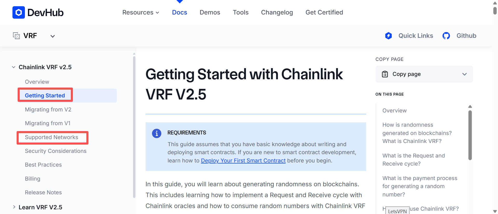

# vrf的使用
[官方文档](https://docs.chain.link/vrf/v2-5/getting-started)
使用教程在Getting Started里
查询各个网络的参数在Supported Networks里

## 案例代码
[remix 案例代码](https://remix.ethereum.org/#url=https://docs.chain.link/samples/VRF/v2-5/VRFD20.sol&autoCompile=true&lang=en&optimize&runs=200&evmVersion&version=soljson-v0.8.31+commit.fd3a2265.js)

### 触发请求，生成requestId
```solidity
uint256 requestId = s_vrfCoordinator.requestRandomWords(
    VRFV2PlusClient.RandomWordsRequest({
        keyHash: i_gasLane, // 最大的gas价格级别
        subId: i_subscriptionId, // 订阅id
        requestConfirmations: REQUEST_CONFIRMATIONS, // 需要被多少个chainLink节点验证
        callbackGasLimit: i_callbackGasLimit,  // 调用回填方法所消耗的最大的gas数量
        numWords: NUM_WORDS,               // 请求回来的随机数个数
        extraArgs: VRFV2PlusClient._argsToBytes(
            VRFV2PlusClient.ExtraArgsV1({nativePayment: false})  // 是用LINK支付还是eth支付
        )
    })
);
```
详细参数解释：https://docs.chain.link/vrf/v2-5/getting-started#contract-variables
另外不同的网络对某些参数的最大值有限制


### 回填随机数
```solidity
function fulfillRandomWords(
    uint256,
    uint256[] calldata randomWords
) internal override {
    uint256 indexOfWinner = (randomWords[0] % s_players.length);
    address payable winner = s_players[indexOfWinner];
    s_recentWinner = winner;
}
```